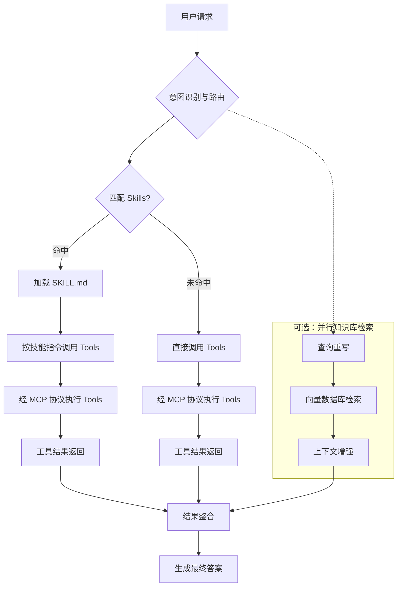

<!-- 最后更新于 2026-05-28 -->

## ReAct 与 Transformer 架构的区别

**问**：ReAct 模式与 Transformer 架构有什么区别？两者如何协同？

**答**：

两者处于**不同抽象层次**：ReAct 是智能体工作范式，Transformer 是底层神经网络架构。

| 对比维度 | Transformer 架构 | ReAct 模式 |
| :--- | :--- | :--- |
| 定义 | 基于自注意力机制的神经网络，LLM 的基础 | 推理与行动结合的提示策略（Reasoning + Acting） |
| 目的 | 捕捉长距离依赖，语义理解与生成 | 通过「思考→行动→观察」循环调用外部工具 |
| 运行逻辑 | 一次性计算预测输出 | 迭代循环：思考 → 行动 → 观察 |
| 对外交互 | 无（知识止于训练数据） | 有（搜索引擎、API、计算器等） |
| 典型应用 | GPT、BERT、T5 等大模型基础 | AutoGPT、智能客服、数据分析 Agent |

**协同关系**：ReAct 实现中，Transformer 架构的大模型充当「思考」引擎；模型决定行动，外部系统执行后将观察结果返回，开始下一轮循环。

**类比**：Transformer 是发动机（提供动力），ReAct 是智能驾驶系统（规划路线、调用工具、达成目标）。

分类标签：Agent与对话 | 更新日期：2026-05-28

---

## Agent 与 RAG 协同 @Tool 动态加载

**问**：如何让 Agent 动态决定是否调用 RAG 检索？请给出使用 @Tool 注解并动态加载工具的设计。

**答**：

- 将 RAG 检索封装为 `@Tool` 方法（含 name、description），返回拼接后的 Document 文本。
- 通过 `KnowledgeToolRegistry` 收集 Spring 容器中所有 `@Tool` Bean。
- `ChatClient.defaultTools()` 注入后，由 LLM 根据工具描述自主决定是否调用知识库。

**代码示例**：

```java
@Component
public class ProductDocumentTool {
    @Tool(name = "query_product_docs", 
         description = "查询产品功能、配置、API使用方法的官方文档知识库。")
    public String queryProductDocs(@ToolParam(description = "用户关于产品的具体问题") String query) {
        List<Document> docs = vectorStore.similaritySearch(SearchRequest.query(query).withTopK(3));
        return docs.stream().map(Document::getContent).collect(Collectors.joining("\n---\n"));
    }
}

@Service
public class KnowledgeToolRegistry {
    @Autowired
    private List<Object> allTools;
    private Map<String, Object> toolMap = new ConcurrentHashMap<>();
    
    @PostConstruct
    public void init() {
        for (Object tool : allTools) {
            // 通过反射获取 @Tool 注解的方法名注册
            toolMap.put(tool.getClass().getSimpleName(), tool);
        }
    }
    
    public Object[] getAllToolInstances() {
        return toolMap.values().toArray();
    }
}

// 配置 ChatClient
@Bean
public ChatClient agentChatClient(ChatClient.Builder builder) {
    return builder
        .defaultSystem("你是一个智能助手，优先使用知识库工具回答问题。")
        .defaultTools(toolRegistry.getAllToolInstances())
        .build();
}
```

分类标签：Agent与对话 | 更新日期：2026-05-28

---

## 多轮对话记忆管理（短期记忆）

**问**：Spring AI 短期记忆如何实现？如何在多轮对话中保持上下文并避免记忆膨胀？

**答**：

- **定位**：短期记忆维护**单次会话**上下文连贯性；默认会话结束后不保留，若使用 JDBC/Redis 等 Repository 则可持久化会话历史。
- **核心组件**：`ChatMemory` 管理对话历史；`ChatMemoryRepository` 负责存储；应用将历史消息作为 Prompt 一部分发送给模型。
- **常用策略**：滑动窗口，`MessageWindowChatMemory` 保留最近 N 条消息。
- **存储实现**：
  - `InMemoryChatMemoryRepository`：开发/测试，重启丢失
  - `JdbcChatMemoryRepository`：关系数据库持久化
  - Redis 或自定义实现：键值存储
- **Advisor 集成**：`MessageChatMemoryAdvisor` 自动注入/保存历史，业务侧无需手写 get/add 循环。
- **ToolContext**：在 Tool 调用间传递会话态，避免全量历史塞入 Prompt；超窗时可压缩历史提取要点。
- **与长期记忆分工**：短期保对话流畅；跨会话用户偏好/事实见 AutoMemoryTools 或向量库 + RAG 专题。

**代码示例**：

```java
@Configuration
public class ChatMemoryConfig {

    @Bean
    public ChatMemoryRepository chatMemoryRepository(JdbcTemplate jdbcTemplate) {
        return new JdbcChatMemoryRepository(jdbcTemplate);
    }

    @Bean
    public ChatMemory chatMemory(ChatMemoryRepository repository) {
        return MessageWindowChatMemory.builder()
                .chatMemoryRepository(repository)
                .maxMessages(20)
                .build();
    }
}

@Service
public class ConversationService {

    private final ChatMemory chatMemory;
    private final ChatClient chatClient;

    public ConversationService(ChatMemory chatMemory, ChatClient chatClient) {
        this.chatMemory = chatMemory;
        this.chatClient = chatClient;
    }

    public String talk(String conversationId, String userMessage) {
        List<Message> history = chatMemory.get(conversationId, 20);
        history.add(new UserMessage(userMessage));
        ChatResponse response = chatClient.call(new ChatRequest(history));
        String assistantMessage = response.getResult().getOutput();
        history.add(new AssistantMessage(assistantMessage));
        chatMemory.add(conversationId, history);
        return assistantMessage;
    }
}

@Bean
public ChatClient chatClient(ChatClient.Builder builder, ChatMemory chatMemory) {
    return builder
        .defaultAdvisors(new MessageChatMemoryAdvisor(chatMemory))
        .build();
}
```

分类标签：Agent与对话 | 更新日期：2026-05-28

---

## AutoMemoryTools 工具驱动型长期记忆

**问**：Spring AI 中如何用 AutoMemoryTools 实现跨会话长期记忆？与短期 ChatMemory 有何不同？

**答**：

- **定位**：长期/永久记忆用于跨会话保留用户偏好、事实陈述、项目决策等；生命周期超出单次会话。
- **机制**：`AutoMemoryTools` 允许模型自主读写 Markdown 文件（`save_to_memory` / `recall_from_memory`），底层由 `MemoryStore`（如 `FileSystemMemoryStore`）持久化。
- **使用方式**：将 `AutoMemoryTools` 注册为 ChatClient 的 Tool，用户无需显式调用，模型根据对话内容自动存取。
- **适用场景**：需要记住少量偏好/事实、希望零代码文件存储的场景；大规模语义检索见向量库 + RAG。

**代码示例**：

```java
@Configuration
public class MemoryToolsConfig {

    @Bean
    public MemoryStore memoryStore() {
        return new FileSystemMemoryStore(Path.of("./memories"));
    }

    @Bean
    public AutoMemoryTools autoMemoryTools(MemoryStore memoryStore) {
        return AutoMemoryTools.builder()
                .memoryStore(memoryStore)
                .build();
    }
}

@Bean
public ChatClient chatClient(ChatModel model, AutoMemoryTools memoryTools) {
    return ChatClient.builder(model)
            .tools(memoryTools)
            .build();
}
```

分类标签：Agent与对话 | 更新日期：2026-05-28

---

## Skills、Tools、MCP 与知识库协同流程

**问**：Agent 场景中 Skills、Tools、MCP 与知识库（RAG）如何协同？请说明从用户请求到最终答案的五步流程。

**答**：

**角色分工**（餐厅类比）：

| 组件 | 角色 |
| :--- | :--- |
| **知识库 (RAG)** | 菜谱与食材手册，提供静态参考知识 |
| **MCP** | 标准化厨房设备接口，厨具即插即用 |
| **Tools** | 具体厨具（炒锅、烤箱），执行具体操作 |
| **Skills** | 标准化菜品 SOP（如宫保鸡丁制作流程） |

**五步流程**：

1. **意图识别与路由**：模型分析自然语言请求，判断需调用哪些能力；Skills 元数据（名称、描述）是主要决策依据。
2. **匹配 Skills 获取任务流**：在 Skills 注册表中匹配合适技能，命中后加载 `SKILL.md`，明确所需 Tools、参数与操作顺序。
3. **执行 Tools（经 MCP）**：按 `SKILL.md` 或模型决策调用 Tools；通过 **MCP 协议**标准化请求（如数据库 Tool 经 MCP 客户端向服务端发起）；知识库检索可**并行**进行（见 RAG 专题）。
4. **结果整合**：Tool 返回值（如 SQL 查询结果）与 RAG 检索结果（如数据字典说明）汇入上下文窗口。
5. **生成最终答案**：模型综合 Tool 输出与检索上下文生成回答。

**分支逻辑**：命中 Skill 时先加载指令再调 Tool；未命中则模型直接选择并调用 Tools，同样经 MCP 执行。

**代码示例**（流程示意）：



分类标签：Agent与对话 | 更新日期：2026-05-28
