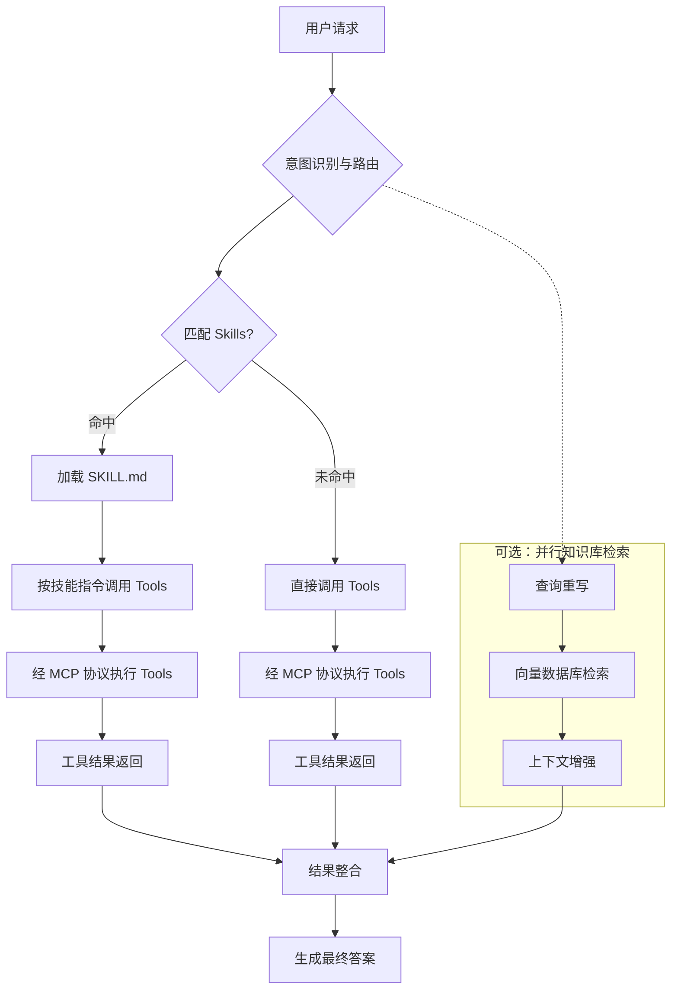

<!-- 最后更新于 2026-05-28 -->

## ReAct 与 Transformer 架构的区别

**问**：ReAct 模式与 Transformer 架构有什么区别？两者如何协同？

**答**：

两者处于**不同抽象层次**：ReAct 是智能体工作范式，Transformer 是底层神经网络架构。

| 对比维度 | Transformer 架构 | ReAct 模式 |
| :--- | :--- | :--- |
| 定义 | 基于自注意力机制的神经网络，LLM 的基础 | 推理与行动结合的提示策略（Reasoning + Acting） |
| 目的 | 捕捉长距离依赖，语义理解与生成 | 通过「思考→行动→观察」循环调用外部工具 |
| 运行逻辑 | 一次性计算预测输出 | 迭代循环：思考 → 行动 → 观察 |
| 对外交互 | 无（知识止于训练数据） | 有（搜索引擎、API、计算器等） |
| 典型应用 | GPT、BERT、T5 等大模型基础 | AutoGPT、智能客服、数据分析 Agent |

**协同关系**：ReAct 实现中，Transformer 架构的大模型充当「思考」引擎；模型决定行动，外部系统执行后将观察结果返回，开始下一轮循环。

**类比**：Transformer 是发动机（提供动力），ReAct 是智能驾驶系统（规划路线、调用工具、达成目标）。

分类标签：Agent与对话 | 更新日期：2026-05-28

---

## Agent 与 RAG 协同 @Tool 动态加载

**问**：如何让 Agent 动态决定是否调用 RAG 检索？请给出使用 @Tool 注解并动态加载工具的设计。

**答**：

- 将 RAG 检索封装为 `@Tool` 方法（含 name、description），返回拼接后的 Document 文本。
- 通过 `KnowledgeToolRegistry` 收集 Spring 容器中所有 `@Tool` Bean。
- `ChatClient.defaultTools()` 注入后，由 LLM 根据工具描述自主决定是否调用知识库。

**代码示例**：

```java
@Component
public class ProductDocumentTool {
    @Tool(name = "query_product_docs", 
         description = "查询产品功能、配置、API使用方法的官方文档知识库。")
    public String queryProductDocs(@ToolParam(description = "用户关于产品的具体问题") String query) {
        List<Document> docs = vectorStore.similaritySearch(SearchRequest.query(query).withTopK(3));
        return docs.stream().map(Document::getContent).collect(Collectors.joining("\n---\n"));
    }
}

@Service
public class KnowledgeToolRegistry {
    @Autowired
    private List<Object> allTools;
    private Map<String, Object> toolMap = new ConcurrentHashMap<>();
    
    @PostConstruct
    public void init() {
        for (Object tool : allTools) {
            // 通过反射获取 @Tool 注解的方法名注册
            toolMap.put(tool.getClass().getSimpleName(), tool);
        }
    }
    
    public Object[] getAllToolInstances() {
        return toolMap.values().toArray();
    }
}

// 配置 ChatClient
@Bean
public ChatClient agentChatClient(ChatClient.Builder builder) {
    return builder
        .defaultSystem("你是一个智能助手，优先使用知识库工具回答问题。")
        .defaultTools(toolRegistry.getAllToolInstances())
        .build();
}
```

分类标签：Agent与对话 | 更新日期：2026-05-28

---

## 多轮对话记忆管理（短期记忆）

**问**：Spring AI 短期记忆如何实现？如何在多轮对话中保持上下文并避免记忆膨胀？

**答**：

- **定位**：短期记忆维护**单次会话**上下文连贯性；默认会话结束后不保留，若使用 JDBC/Redis 等 Repository 则可持久化会话历史。
- **核心组件**：`ChatMemory` 管理对话历史；`ChatMemoryRepository` 负责存储；应用将历史消息作为 Prompt 一部分发送给模型。
- **常用策略**：滑动窗口，`MessageWindowChatMemory` 保留最近 N 条消息。
- **存储实现**：
  - `InMemoryChatMemoryRepository`：开发/测试，重启丢失
  - `JdbcChatMemoryRepository`：关系数据库持久化
  - Redis 或自定义实现：键值存储
- **Advisor 集成**：`MessageChatMemoryAdvisor` 自动注入/保存历史，业务侧无需手写 get/add 循环。
- **ToolContext**：在 Tool 调用间传递会话态，避免全量历史塞入 Prompt；超窗时可压缩历史提取要点。
- **与长期记忆分工**：短期保对话流畅；跨会话用户偏好/事实见 AutoMemoryTools 或向量库 + RAG 专题。

**代码示例**：

```java
@Configuration
public class ChatMemoryConfig {

    @Bean
    public ChatMemoryRepository chatMemoryRepository(JdbcTemplate jdbcTemplate) {
        return new JdbcChatMemoryRepository(jdbcTemplate);
    }

    @Bean
    public ChatMemory chatMemory(ChatMemoryRepository repository) {
        return MessageWindowChatMemory.builder()
                .chatMemoryRepository(repository)
                .maxMessages(20)
                .build();
    }
}

@Service
public class ConversationService {

    private final ChatMemory chatMemory;
    private final ChatClient chatClient;

    public ConversationService(ChatMemory chatMemory, ChatClient chatClient) {
        this.chatMemory = chatMemory;
        this.chatClient = chatClient;
    }

    public String talk(String conversationId, String userMessage) {
        List<Message> history = chatMemory.get(conversationId, 20);
        history.add(new UserMessage(userMessage));
        ChatResponse response = chatClient.call(new ChatRequest(history));
        String assistantMessage = response.getResult().getOutput();
        history.add(new AssistantMessage(assistantMessage));
        chatMemory.add(conversationId, history);
        return assistantMessage;
    }
}

@Bean
public ChatClient chatClient(ChatClient.Builder builder, ChatMemory chatMemory) {
    return builder
        .defaultAdvisors(new MessageChatMemoryAdvisor(chatMemory))
        .build();
}
```

分类标签：Agent与对话 | 更新日期：2026-05-28

---

## AutoMemoryTools 工具驱动型长期记忆

**问**：Spring AI 中如何用 AutoMemoryTools 实现跨会话长期记忆？与短期 ChatMemory 有何不同？

**答**：

- **定位**：长期/永久记忆用于跨会话保留用户偏好、事实陈述、项目决策等；生命周期超出单次会话。
- **机制**：`AutoMemoryTools` 允许模型自主读写 Markdown 文件（`save_to_memory` / `recall_from_memory`），底层由 `MemoryStore`（如 `FileSystemMemoryStore`）持久化。
- **使用方式**：将 `AutoMemoryTools` 注册为 ChatClient 的 Tool，用户无需显式调用，模型根据对话内容自动存取。
- **适用场景**：需要记住少量偏好/事实、希望零代码文件存储的场景；大规模语义检索见向量库 + RAG。

**代码示例**：

```java
@Configuration
public class MemoryToolsConfig {

    @Bean
    public MemoryStore memoryStore() {
        return new FileSystemMemoryStore(Path.of("./memories"));
    }

    @Bean
    public AutoMemoryTools autoMemoryTools(MemoryStore memoryStore) {
        return AutoMemoryTools.builder()
                .memoryStore(memoryStore)
                .build();
    }
}

@Bean
public ChatClient chatClient(ChatModel model, AutoMemoryTools memoryTools) {
    return ChatClient.builder(model)
            .tools(memoryTools)
            .build();
}
```

分类标签：Agent与对话 | 更新日期：2026-05-28

---

## Skills、Tools、MCP 与知识库协同流程（含数据库场景）

**问**：Spring AI 智能体操作数据库时，Skills、Tools、MCP 与知识库（RAG）如何协同？匹配与执行顺序是什么？

**答**：

协作本质为 **意图路由 → 技能匹配 → 工具调用与知识检索并行 → 结果整合 → 生成答案**。

**核心组件定位**（以操作数据库为例）：

| 组件 | 角色与定位 |
| :--- | :--- |
| **知识库 (RAG)** | **静态数据源**。向量检索提供上下文；库中常存业务知识、Schema 元数据、历史查询模板 |
| **Tools** | **原子动作**。可执行 SQL、调 API、发邮件等，是可执行逻辑的最小单元 |
| **MCP** | **标准化工具连接协议**。统一模型与外部工具/数据源的接入方式，解决多系统适配 |
| **Skills** | **可复用任务工作流**。封装完成特定业务所需的 Tools、知识与步骤；如「查询数据库」Skill 含 MCP `execute_sql` 与相关 Schema 知识 |

**角色分工**（餐厅类比）：

| 组件 | 角色 |
| :--- | :--- |
| **知识库 (RAG)** | 菜谱与食材手册，提供静态参考知识 |
| **MCP** | 标准化厨房设备接口，厨具即插即用 |
| **Tools** | 具体厨具（炒锅、烤箱），执行具体操作 |
| **Skills** | 标准化菜品 SOP（如宫保鸡丁制作流程） |

**五步流程**：

1. **意图识别与路由**：分析自然语言请求（如「查询上海地区销售数据」），判断需调用哪些能力；以 Skills 元数据（名称、描述）为主要决策依据。
2. **匹配 Skills 获取任务流**：在注册表中匹配合适技能，命中后加载 `SKILL.md`（明确 Tools、参数与操作步骤）。
3. **执行 Tools（经 MCP）**：按 `SKILL.md` 或模型决策调用 Tools；数据库类 Tool 经 MCP 客户端向服务端发起；**RAG 检索与此并行**（见 RAG 专题）。
4. **结果整合**：`execute_sql` 等 Tool 返回数据集与 RAG 返回的数据字典说明等一并进入上下文窗口。
5. **生成最终答案**：模型综合 Tool 输出与检索上下文生成回答。

**分支逻辑**：命中 Skill 时先加载指令再调 Tool；未命中则模型直接选择并调用 Tools，同样经 MCP 执行。

**代码示例**（流程示意）：



分类标签：Agent与对话 | 更新日期：2026-05-28

---

## SequentialAgent 与 LoopAgent 工作流

**问**：Spring AI Alibaba 中如何实现多 Agent 串行流水线与条件循环？

**答**：

- **SequentialAgent**：按 A → B → C 顺序执行，前一 Agent 的 `outputKey` 作为下一 Agent 输入，适合写作→审阅→润色等固定流水线。
- **LoopAgent**：子 Agent 循环执行直到 `condition` 返回 false 或达到 `maxIterations`，适合规划→评审→再规划直到评分达标。

**代码示例**：

```java
ReactAgent agentA = ReactAgent.builder()
    .name("writer")
    .model(chatModel)
    .instruction("Write content based on: {input}")
    .outputKey("article")
    .build();

ReactAgent agentB = ReactAgent.builder()
    .name("reviewer")
    .model(chatModel)
    .instruction("Review and improve: {article}")
    .outputKey("reviewed")
    .build();

ReactAgent agentC = ReactAgent.builder()
    .name("polisher")
    .model(chatModel)
    .instruction("Polish: {reviewed}")
    .outputKey("final")
    .build();

SequentialAgent workflow = SequentialAgent.builder()
    .name("blogPipeline")
    .subAgents(List.of(agentA, agentB, agentC))
    .build();

workflow.invoke("Spring AI basics");

LoopAgent loopAgent = LoopAgent.builder()
    .name("planningLoop")
    .subAgents(List.of(plannerAgent, reviewerAgent))
    .condition(state -> {
        int score = extractScore(state.get("review_result"));
        return score < 80;
    })
    .maxIterations(5)
    .build();
```

分类标签：Agent与对话 | 更新日期：2026-05-28

---

## 共享 ChatMemory 的多 Agent 协作

**问**：多个 Agent 如何基于外部记忆实现多轮双向交互？

**答**：

- 多个 `ReactAgent` 共享同一 `ChatMemory` 实例（如 `InMemoryChatMemory`）。
- 交替调用各 Agent，历史消息自动写入共享 memory，后续 Agent 可读取完整对话上下文。
- 适合辩论、协作写作、角色扮演等需要「共同记忆」的场景。

**代码示例**：

```java
ChatMemory memory = new InMemoryChatMemory();
Agent a = new ReactAgent(..., memory);
Agent b = new ReactAgent(..., memory);
// 多轮交替调用，共享对话历史
```

分类标签：Agent与对话 | 更新日期：2026-05-28

---

## Orchestrator 子任务拆解与 CoT/ToT 推理

**问**：复杂任务如何拆解为子任务？Chain-of-Thought 与 Tree-of-Thoughts 有何区别？

**答**：

**Orchestrator 模式（规划→执行→聚合）**：

1. LLM 将目标分解为 3–5 个子任务。
2. Worker Agent 逐个执行子任务。
3. Aggregator 合并子结果输出最终答案。

**Chain-of-Thought (CoT)**：在 Prompt 中引导模型「逐步思考」，显式列出推理步骤后再给出答案，适合算术、逻辑推理。

**Tree-of-Thoughts (ToT)**：在 CoT 基础上扩展为树搜索——每层生成多个 thought 分支，评估后剪枝（beam search），适合需要探索多条推理路径的复杂问题。

**代码示例（Orchestrator）**：

```java
public class Orchestrator {
    public String execute(String goal) {
        List<String> subTasks = decompose(goal);
        List<String> results = new ArrayList<>();
        for (String task : subTasks) {
            results.add(workerAgent.act(task));
        }
        return aggregator.merge(results);
    }

    private List<String> decompose(String goal) {
        String response = chatClient.prompt()
            .user("Break this goal into 3-5 subtasks: " + goal)
            .call().content();
        return parseSubtasks(response);
    }
}
```

**代码示例（CoT Prompt）**：

```java
String prompt = """
Question: Roger has 5 tennis balls. He buys 2 more cans of 3 balls each. How many does he have?
Let's think step by step:
 1. Roger starts with 5 balls.
 2. Each can has 3 balls, and he buys 2 cans → 2 * 3 = 6 balls.
 3. Total = 5 + 6 = 11.
    Answer: 11
    Now answer: {question}
    """;
```

**代码示例（ToT 框架）**：

```java
public class TreeOfThoughts {
    public String solve(String problem) {
        List<Node> currentLevel = List.of(new Node(problem, null));
        for (int depth = 0; depth < maxDepth; depth++) {
            List<Node> nextLevel = new ArrayList<>();
            for (Node node : currentLevel) {
                List<String> thoughts = generateThoughts(node.state);
                for (String thought : thoughts) {
                    String newState = evaluate(thought);
                    nextLevel.add(new Node(newState, node));
                }
            }
            currentLevel = prune(nextLevel, beamWidth);
        }
        return bestLeaf(currentLevel).getSolution();
    }
}
```

分类标签：Agent与对话 | 更新日期：2026-05-28

---

## Spring AI 常见工作流模式

**问**：Spring AI / Alibaba 生态中有哪些典型 Agent 工作流模式？各自适用场景是什么？

**答**：

| 模式 | 核心用途 | 典型组件 |
| :--- | :--- | :--- |
| **链式 (Chain)** | 固定顺序流水线 | `ChainWorkflow`、顺序 Prompt 列表 |
| **路由 (Routing)** | 按意图分发到专业 Agent | `LlmRoutingAgent` |
| **并行 (Parallelization)** | 并发独立子任务 | `ParallelizationWorkflow` |
| **编排器-工作者** | 动态拆解 + 并行执行 | `@ParallelAgent`、`@SubAgent` |
| **评估器-优化器** | 迭代改进直到达标 | Evaluator + Optimizer 循环 |

**代码示例（链式）**：

```java
public class ChainWorkflow {
    private final ChatClient client;
    private final List<String> prompts;

    public String execute(String input) {
        String result = input;
        for (String prompt : prompts) {
            result = client.prompt(prompt + "\n" + result).call().content();
        }
        return result;
    }
}
```

**代码示例（路由）**：

```java
LlmRoutingAgent router = LlmRoutingAgent.builder()
    .name("router")
    .model(chatModel)
    .subAgents(List.of(weatherAgent, newsAgent, financeAgent))
    .build();

router.invoke("What's the weather in London?");
```

**代码示例（并行）**：

```java
ParallelizationWorkflow workflow = new ParallelizationWorkflow(chatClient);
List<String> tasks = List.of("Impact on customers", "Impact on employees", "Impact on suppliers");
List<String> results = workflow.parallel(
    "Analyze how market change affects stakeholders",
    tasks,
    maxConcurrency = 4
);
```

**代码示例（编排器-工作者）**：

```java
@ParallelAgent
public class Orchestrator {
    @SubAgent
    public String researchAgent(String topic) { ... }

    @SubAgent
    public String writerAgent(String outline) { ... }

    @ParallelTask
    public List<String> gatherData(String[] sources) { ... }
}
```

**代码示例（评估器-优化器）**：

```java
public class IterativeRefinement {
    public String refine(String initialDraft) {
        String current = initialDraft;
        for (int i = 0; i < maxIterations; i++) {
            String feedback = evaluator.evaluate(current);
            if (isAcceptable(feedback)) break;
            current = optimizer.improve(current, feedback);
        }
        return current;
    }
}
```

分类标签：Agent与对话 | 更新日期：2026-05-28

---

## 多智能体监督与交接模式

**问**：多 Agent 系统中「工具调用模式」与「交接模式」有何区别？Handoff 如何实现？

**答**：

- **工具调用模式（Supervisor）**：监督 Agent 将其他 Agent 封装为 Tool 调用，由监督者统一调度。
- **交接模式（Handoff）**：当前 Agent 通过 `transfer_to` 将控制权移交给更专业的 Agent，类似客服转技术岗。
- **适用**：复杂客服、多领域问答——前台 Agent 识别意图后 handoff 到领域专家。

**代码示例（交接模式概念）**：

```java
Agent supportAgent = new HandoffAgent("support", chatModel);
Agent technicalAgent = new HandoffAgent("technical", chatModel);
supportAgent.registerHandoff("technical_issue", technicalAgent);
```

分类标签：Agent与对话 | 更新日期：2026-05-28
