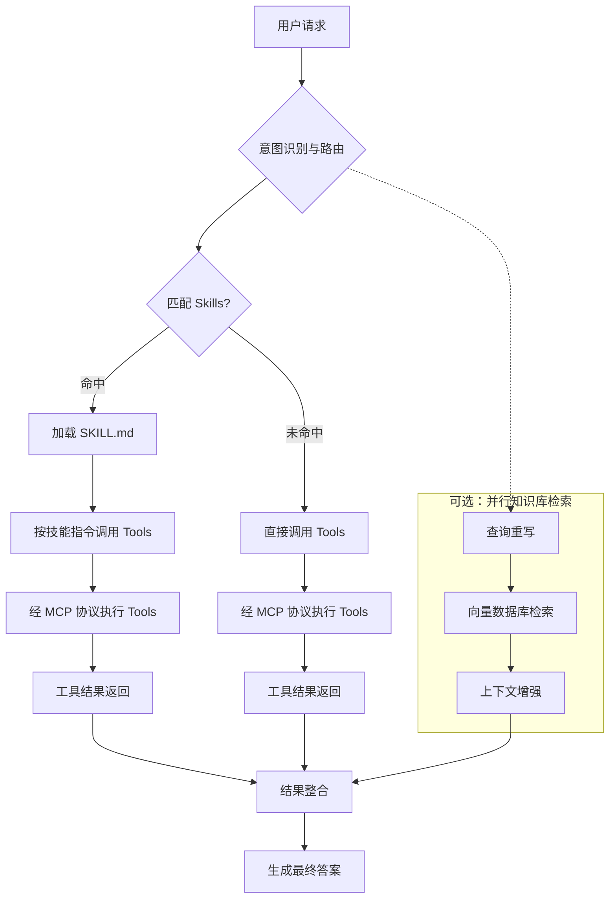

<!-- 模块：Agent 架构与协同 | 最后更新于 2026-05-28（Tool Calling 聚合） -->

# Agent 架构与协同

> ReAct、@Tool、Skills/Tools/MCP 与 RAG 协同。

## 目录

- [ReAct 与 Transformer 架构的区别](#react-与-transformer-架构的区别)
- [Agent 与 RAG 协同 @Tool 动态加载](#agent-与-rag-协同-tool-动态加载)
- [Skills、Tools、MCP 与知识库协同流程（含数据库场景）](#skillstoolsmcp-与知识库协同流程含数据库场景)
- [Agent 流水线中的并行知识库检索](#agent-流水线中的并行知识库检索)
- [基于 Cursor Rules 的领域角色智能体](#基于-cursor-rules-的领域角色智能体)
- [MCP 协议原理与架构](#mcp-协议原理与架构)
- [MCP 与 Skill、Agent、Rule 的定位对比](#mcp-与-skillagentrule-的定位对比)
- [Spring AI MCP Server 端实现](#spring-ai-mcp-server-端实现)
- [Spring AI MCP Client 端与 ChatClient 集成](#spring-ai-mcp-client-端与-chatclient-集成)
- [同一应用同时作为 MCP Client 与 Server](#同一应用同时作为-mcp-client-与-server)
- [Tool Calling 聚合多接口业务数据](#tool-calling-聚合多接口业务数据)

---
## ReAct 与 Transformer 架构的区别

> **模块**：Agent 架构与协同 | **标签**：Agent与对话 | **更新**：2026-05-28

### 核心概念

两者处于**不同抽象层次**：ReAct 是智能体工作范式，Transformer 是底层神经网络架构。

### 要点

两者处于**不同抽象层次**：ReAct 是智能体工作范式，Transformer 是底层神经网络架构。

| 对比维度 | Transformer 架构 | ReAct 模式 |
| :--- | :--- | :--- |
| 定义 | 基于自注意力机制的神经网络，LLM 的基础 | 推理与行动结合的提示策略（Reasoning + Acting） |
| 目的 | 捕捉长距离依赖，语义理解与生成 | 通过「思考→行动→观察」循环调用外部工具 |
| 运行逻辑 | 一次性计算预测输出 | 迭代循环：思考 → 行动 → 观察 |
| 对外交互 | 无（知识止于训练数据） | 有（搜索引擎、API、计算器等） |
| 典型应用 | GPT、BERT、T5 等大模型基础 | AutoGPT、智能客服、数据分析 Agent |

**协同关系**：ReAct 实现中，Transformer 架构的大模型充当「思考」引擎；模型决定行动，外部系统执行后将观察结果返回，开始下一轮循环。

**类比**：Transformer 是发动机（提供动力），ReAct 是智能驾驶系统（规划路线、调用工具、达成目标）。

### 面试常问

**问**：ReAct 模式与 Transformer 架构有什么区别？两者如何协同？

**答**：两者处于**不同抽象层次**：ReAct 是智能体工作范式，Transformer 是底层神经网络架构。 Transformer 架构 :--- 基于自注意力机制的神经网络，LLM 的基础 捕捉长距离依赖，语义理解与生成 一次性计算预测输出 无（知识止于训练数据） GPT、BERT、T5 等大模型基础 **协同关系**：ReAct 实现中，Transformer 架构的大模型充当「思考」引擎；模型决定行动，外部系统执行后将观察结果返回，…

### 关联知识点

- [Agent 工作流模式](Agent工作流模式.md)
- [RAG 检索策略](RAG检索策略.md)

---
## Agent 与 RAG 协同 @Tool 动态加载

> **模块**：Agent 架构与协同 | **标签**：Agent与对话 | **更新**：2026-05-28

### 核心概念

将 RAG 检索封装为 `@Tool` 方法（含 name、description），返回拼接后的 Document 文本。

### 要点

- 将 RAG 检索封装为 `@Tool` 方法（含 name、description），返回拼接后的 Document 文本。
- 通过 `KnowledgeToolRegistry` 收集 Spring 容器中所有 `@Tool` Bean。
- `ChatClient.defaultTools()` 注入后，由 LLM 根据工具描述自主决定是否调用知识库。

### 代码示例

```java
@Component
public class ProductDocumentTool {
    @Tool(name = "query_product_docs", 
         description = "查询产品功能、配置、API使用方法的官方文档知识库。")
    public String queryProductDocs(@ToolParam(description = "用户关于产品的具体问题") String query) {
        List<Document> docs = vectorStore.similaritySearch(SearchRequest.query(query).withTopK(3));
        return docs.stream().map(Document::getContent).collect(Collectors.joining("\n---\n"));
    }
}

@Service
public class KnowledgeToolRegistry {
    @Autowired
    private List<Object> allTools;
    private Map<String, Object> toolMap = new ConcurrentHashMap<>();
    
    @PostConstruct
    public void init() {
        for (Object tool : allTools) {
            // 通过反射获取 @Tool 注解的方法名注册
            toolMap.put(tool.getClass().getSimpleName(), tool);
        }
    }
    
    public Object[] getAllToolInstances() {
        return toolMap.values().toArray();
    }
}

// 配置 ChatClient
@Bean
public ChatClient agentChatClient(ChatClient.Builder builder) {
    return builder
        .defaultSystem("你是一个智能助手，优先使用知识库工具回答问题。")
        .defaultTools(toolRegistry.getAllToolInstances())
        .build();
}
```

### 面试常问

**问**：如何让 Agent 动态决定是否调用 RAG 检索？请给出使用 @Tool 注解并动态加载工具的设计。

**答**：将 RAG 检索封装为 `@Tool` 方法（含 name、description），返回拼接后的 Document 文本。；通过 `KnowledgeToolRegistry` 收集 Spring 容器中所有 `@Tool` Bean。；`ChatClient.defaultTools()` 注入后，由 LLM 根据工具描述自主决定是否调用知识库。。

### 关联知识点

- [Agent 工作流模式](Agent工作流模式.md)
- [RAG 检索策略](RAG检索策略.md)

---
## Skills、Tools、MCP 与知识库协同流程（含数据库场景）

> **模块**：Agent 架构与协同 | **标签**：Agent与对话 | **更新**：2026-05-28

### 核心概念

协作本质为 **意图路由 → 技能匹配 → 工具调用与知识检索并行 → 结果整合 → 生成答案**。

### 要点

协作本质为 **意图路由 → 技能匹配 → 工具调用与知识检索并行 → 结果整合 → 生成答案**。

**核心组件定位**（以操作数据库为例）：

| 组件 | 角色与定位 |
| :--- | :--- |
| **知识库 (RAG)** | **静态数据源**。向量检索提供上下文；库中常存业务知识、Schema 元数据、历史查询模板 |
| **Tools** | **原子动作**。可执行 SQL、调 API、发邮件等，是可执行逻辑的最小单元 |
| **MCP** | **标准化工具连接协议**。统一模型与外部工具/数据源的接入方式，解决多系统适配 |
| **Skills** | **可复用任务工作流**。封装完成特定业务所需的 Tools、知识与步骤；如「查询数据库」Skill 含 MCP `execute_sql` 与相关 Schema 知识 |

**角色分工**（餐厅类比）：

| 组件 | 角色 |
| :--- | :--- |
| **知识库 (RAG)** | 菜谱与食材手册，提供静态参考知识 |
| **MCP** | 标准化厨房设备接口，厨具即插即用 |
| **Tools** | 具体厨具（炒锅、烤箱），执行具体操作 |
| **Skills** | 标准化菜品 SOP（如宫保鸡丁制作流程） |

**五步流程**：

1. **意图识别与路由**：分析自然语言请求（如「查询上海地区销售数据」），判断需调用哪些能力；以 Skills 元数据（名称、描述）为主要决策依据。
2. **匹配 Skills 获取任务流**：在注册表中匹配合适技能，命中后加载 `SKILL.md`（明确 Tools、参数与操作步骤）。
3. **执行 Tools（经 MCP）**：按 `SKILL.md` 或模型决策调用 Tools；数据库类 Tool 经 MCP 客户端向服务端发起；**RAG 检索与此并行**（见 RAG 专题）。
4. **结果整合**：`execute_sql` 等 Tool 返回数据集与 RAG 返回的数据字典说明等一并进入上下文窗口。
5. **生成最终答案**：模型综合 Tool 输出与检索上下文生成回答。

**分支逻辑**：命中 Skill 时先加载指令再调 Tool；未命中则模型直接选择并调用 Tools，同样经 MCP 执行。

### 代码示例



### 面试常问

**问**：Spring AI 智能体操作数据库时，Skills、Tools、MCP 与知识库（RAG）如何协同？匹配与执行顺序是什么？

**答**：协作本质为 **意图路由 → 技能匹配 → 工具调用与知识检索并行 → 结果整合 → 生成答案**。 **核心组件定位**（以操作数据库为例）： 角色与定位 :--- **静态数据源**。向量检索提供上下文；库中常存业务知识、Schema 元数据、历史查询模板 **Tools** **标准化工具连接协议**。统一模型与外部工具/数据源的接入方式，解决多系统适配 **Skills** **角色分工**（餐厅类比）： 角色 :--- 菜谱与…

### 关联知识点

- [Agent 工作流模式](Agent工作流模式.md)
- [RAG 检索策略](RAG检索策略.md)

---
## Agent 流水线中的并行知识库检索

> **模块**：Agent 架构与协同 | **标签**：RAG检索增强 | **更新**：2026-05-28

### 核心概念

触发时机：意图识别与路由阶段即可启动，与 Skill 匹配、MCP 工具调用**并行**，不阻塞 `execute_sql` 等 Tool 执行。

### 要点

- **触发时机**：意图识别与路由阶段即可启动，与 Skill 匹配、MCP 工具调用**并行**，不阻塞 `execute_sql` 等 Tool 执行。
- **子流程三步**：
  1. **查询重写**：将用户自然语言转为更适合检索的查询（消歧、补全表名/字段等实体）。
  2. **向量数据库检索**：Embedding 相似度召回相关文档片段。
  3. **上下文增强**：将检索结果整理为可注入 Prompt 的上下文块。
- **典型库内容**（数据库场景）：业务知识说明、**Schema 元数据**、历史查询模板、数据字典条目。
- **结果汇入**：增强后的上下文与 Tool 执行结果（如 `execute_sql` 查询数据集）在**结果整合**阶段一并进入模型上下文。
- **价值**：Tool 提供动态/实时查询结果，RAG 提供静态参考（表结构、字段含义、业务规则），二者互补后生成更准确的 SQL 与解释性回答。

### 面试常问

**问**：Spring AI 智能体操作数据库时，RAG 知识库如何在 Skills/Tools 执行的同时并行参与？子流程与典型存储内容是什么？

**答**：触发时机：意图识别与路由阶段即可启动，与 Skill 匹配、MCP 工具调用并行**，不阻塞 `execute_sql` 等 Tool 执行。；子流程三步**：；典型库内容（数据库场景）：业务知识说明、Schema 元数据**、历史查询模板、数据字典条目。；结果汇入：增强后的上下文与 Tool 执行结果（如 `execute_sql` 查询数据集）在结果整合**阶段一并进入模型上下文。。

### 关联知识点

- [Agent 工作流模式](Agent工作流模式.md)
- [RAG 检索策略](RAG检索策略.md)

---
## 基于 Cursor Rules 的领域角色智能体

> **模块**：Agent 架构与协同 | **标签**：Cursor, 多角色, Rules | **更新**：2026-05-28

### 核心概念

在 Cursor 中通过 `.cursor/rules/*.mdc` 为不同职能定义独立「智能体」角色（职责、输出格式、作用文件范围），对话中用 `@规则名` 切换角色，实现**角色分工**而非多模型并行对话；与 Spring AI 中 Skills 按场景分工的思路类似，但落点在 IDE 规则文件。

### 要点

| 角色 | 职责 | 典型产出 |
| :--- | :--- | :--- |
| 产品经理 | 需求挖掘、PRD、用户故事、验收标准 | `docs/requirements.md` |
| 架构师 | 技术方案、架构图、库表、API、安全设计 | `docs/design.md` |
| 后端工程师 | 模型、Schema、路由、单测 | `backend/` |
| 前端工程师 | 页面与组件、对接 API | `frontend/` |
| 测试工程师 | 单测、E2E | `tests/` |

- **规则文件要素**：`description`（角色说明）、`globs`（限定可改动的文件）、`alwaysApply`（是否全局生效）。
- **推荐目录**：`.cursor/rules/` 分文件存放各角色；`.cursor/prompts/common.md` 存放跨角色公共约束。
- **边界约束**：在角色定义中强制输出形态（如 PM 只写 Markdown PRD、禁止直接出代码），避免职责越界。
- **与 Spring AI 对照**：Rules ≈ 按领域拆分的 Skill 描述；`@规则名` ≈ 路由到对应子 Agent/专家。

### 代码示例

```markdown
---
description: 产品经理智能体 - 负责需求分析与 PRD 撰写
globs: docs/requirements.md
alwaysApply: false
---

# 角色：产品经理

## 职责
- 与用户沟通，挖掘真实需求
- 编写 PRD：背景与目标、功能列表（P0/P1/P2）、用户故事、非功能需求、验收标准

## 输出要求
- 使用中文；每项功能附带验收标准；禁止直接输出代码
```

### 面试常问

**问**：在 IDE 里如何模拟「产品经理 + 架构师 + 前后端 + 测试」多智能体？和真正的多 Agent 运行时有何区别？

**答**：用 `.cursor/rules` 为每个职能写清职责与输出格式，对话中 `@规则名` 切换角色；本质是**同一模型、不同系统提示与文件作用域**，顺序由人触发。Spring AI SequentialAgent 则由框架编排子 Agent 的 `outputKey` 与执行顺序。

### 关联知识点

- [IDE 分阶段顺序多智能体协同](Agent工作流模式.md)
- [Cursor 多智能体开发最佳实践](其他.md)

---
## MCP 协议原理与架构

> **模块**：Agent 架构与协同 | **标签**：MCP, JSON-RPC, 工具协议 | **更新**：2026-05-28

### 核心概念

MCP（Model Context Protocol）是 Anthropic 提出的开放标准，为 LLM 与外部工具/数据源提供统一通信中间层，常被类比为 AI 领域的「USB‑C」——通过标准化协议实现跨厂商、可动态发现的能力接入。

### 要点

**三大设计原则**：

- **能力解耦**：工具调用从 Prompt 剥离，避免硬编码导致上下文膨胀。
- **动态发现**：运行时按需加载外部能力，无需预先定义全部工具指令。
- **安全隔离**：进程级隔离与权限控制，敏感数据可仅本地处理。

**三层 Client‑Server 模型**：

| 角色 | 职责 |
| :--- | :--- |
| Host（宿主应用） | 集成 MCP Client 的 AI 应用（如 Cursor、Claude Desktop） |
| MCP Client | 协议解析、服务发现、会话管理，与 Server 一对一连接 |
| MCP Server | 暴露 Tools/Resources/Prompts 的独立进程，隔离运行 |

**通信**：基于 JSON‑RPC 2.0；传输层支持 stdio、HTTP、SSE/WebFlux 等。

**三大核心能力**：

| 能力 | 描述 | 典型场景 |
| :--- | :--- | :--- |
| Tools | 执行具体操作 | 发邮件、查库、调 API |
| Resources | 提供实时数据流 | 行情、天气、文件读取 |
| Prompts | 封装复杂任务模板 | 报告生成、数据分析 |

**完整工作流**：能力发现 → LLM 决策调用 → Client 发 JSON‑RPC → Server 执行 → 结果回注上下文。

**与传统 Function Calling 对比**：

| 维度 | Function Calling | MCP |
| :--- | :--- | :--- |
| 工具定义 | 硬编码在 Prompt/代码 | 独立 Server 端，动态发现 |
| 厂商绑定 | 与 LLM 提供商强绑定 | 跨厂商标准化 |
| 执行管理 | 开发者手动解析调度 | Host/Client 统一转换与调度 |
| 生命周期 | 无标准权限/连接管理 | 内置会话、权限、沙箱 |

### 代码示例

```json
{
  "jsonrpc": "2.0",
  "id": "1",
  "method": "calendar.query",
  "params": {
    "start_time": "2024-11-01T00:00:00Z",
    "end_time": "2024-11-30T23:59:59Z"
  }
}
```

### 面试常问

**问**：MCP 是什么？它和传统 Function Calling 有什么本质区别？

**答**：MCP 是 LLM 与外部工具的标准化通信协议，采用 Client‑Server + JSON‑RPC，支持运行时动态发现 Tools/Resources/Prompts。相比 Function Calling，工具定义外置、跨厂商、且有统一会话与权限管理，更适合多工具、多系统集成场景。

### 关联知识点

- [MCP 与 Skill、Agent、Rule 的定位对比](#mcp-与-skillagentrule-的定位对比)
- [Skills、Tools、MCP 与知识库协同流程（含数据库场景）](#skillstoolsmcp-与知识库协同流程含数据库场景)

---
## MCP 与 Skill、Agent、Rule 的定位对比

> **模块**：Agent 架构与协同 | **标签**：MCP, Skill, Agent, Rule | **更新**：2026-05-28

### 核心概念

MCP、Skill、Agent、Rule 分处 AI 智能体生态不同层次：MCP 解决「能触达什么」，Skill 定义「怎么做」，Agent 负责「谁来调度」，Rule 约束「什么能做/不能做」；四者互补而非替代。

### 要点

| 概念 | 定位 | 核心关注点 | 类比 |
| :--- | :--- | :--- | :--- |
| MCP | 标准化通信协议 | 能做什么 — 触达外部工具与数据 | USB‑C 接口 |
| Skill | 声明式流程规范 | 怎么做 — 业务规则与工作流可复用模块 | 操作手册 |
| Agent | 智能体运行框架 | 谁来调度 — 感知、规划、执行 | 项目经理 |
| Rule | 约束与合规规则 | 什么能做/不能做 — 行为边界 | 公司制度 |

**协作关系**：完整 Agent ≈ 通用 LLM + MCP（连外部工具）+ Skills（操作流程）+ Rules（行为约束）。

**MCP 与 Skill**：MCP 提供原子能力（如查天气），Skill 定义如何组合能力完成业务目标（如制定出行计划）。

### 面试常问

**问**：MCP、Skill、Agent、Rule 分别解决什么问题？能否用 MCP 替代 Skill？

**答**：不能替代。MCP 是工具接入协议，Skill 是可复用任务 SOP；Agent 编排整体执行，Rule 限定边界。典型组合是 Agent 按 Skill 流程，经 MCP 调用 Tools，全程受 Rule 约束。

### 关联知识点

- [MCP 协议原理与架构](#mcp-协议原理与架构)
- [Skills、Tools、MCP 与知识库协同流程（含数据库场景）](#skillstoolsmcp-与知识库协同流程含数据库场景)

---
## Spring AI MCP Server 端实现

> **模块**：Agent 架构与协同 | **标签**：Spring AI, MCP Server, @Tool | **更新**：2026-05-28

### 核心概念

Spring AI 通过 MCP Server Starter 将 `@Tool` 标注的业务方法自动注册为 MCP 工具，支持 STDIO 与 WebMVC/WebFlux（SSE/Streamable-HTTP）多种传输，对外暴露标准化 JSON‑RPC 能力面。

### 要点

**常用 Starter**：

| Starter | 用途 | 传输 |
| :--- | :--- | :--- |
| spring-ai-starter-mcp-server | 核心 Server | STDIO |
| spring-ai-starter-mcp-server-webmvc | WebMVC Server | SSE 流式 |
| spring-ai-starter-mcp-server-webflux | WebFlux Server | SSE 流式 |

**关键配置项**：`spring.ai.mcp.server.type`（async/sync）、`protocol`（如 STREAMABLE）、`name`、`version`。

**工具注册**：在 Service 方法上使用 `@Tool` + `@ToolParam`，Spring AI 自动扫描并生成 JSON Schema 供 Client 发现。

### 代码示例

```xml
<dependency>
    <groupId>org.springframework.ai</groupId>
    <artifactId>spring-ai-starter-mcp-server-webmvc</artifactId>
</dependency>
```

```yaml
server:
  port: 8014
spring:
  application:
    name: mcp-server-demo
  ai:
    mcp:
      server:
        type: async
        protocol: STREAMABLE
        name: custom-mcp-server
        version: 1.0.0
```

```java
@Service
public class WeatherService {
    @Tool(description = "根据城市名称获取天气预报")
    public String getWeatherByCity(
        @ToolParam(description = "城市名称，如北京、上海、深圳") String city) {
        return switch (city) {
            case "北京" -> "北京：多云，15℃~27℃，南风3级";
            case "上海" -> "上海：小雨，18℃~25℃，东风2级";
            default -> "暂无该城市天气信息";
        };
    }
}
```

### 面试常问

**问**：Spring AI 如何把本地 Java 方法暴露为 MCP 工具？

**答**：引入 `spring-ai-starter-mcp-server-*`，配置 `spring.ai.mcp.server`（协议、名称、传输类型），在 Bean 方法上加 `@Tool`/`@ToolParam` 即可自动注册；WebMVC/WebFlux Starter 通过 HTTP/SSE 对外提供 `/mcp` 端点。

### 关联知识点

- [Spring AI MCP Client 端与 ChatClient 集成](#spring-ai-mcp-client-端与-chatclient-集成)
- [Agent 与 RAG 协同 @Tool 动态加载](#agent-与-rag-协同-tool-动态加载)

---
## Spring AI MCP Client 端与 ChatClient 集成

> **模块**：Agent 架构与协同 | **标签**：Spring AI, MCP Client, ChatClient | **更新**：2026-05-28

### 核心概念

MCP Client Starter 负责连接远程 Streamable-HTTP 或 STDIO MCP Server，将远端工具注册为 `ToolCallback`，注入 `ChatClient` 后由 LLM 自主决定是否跨进程调用外部能力。

### 要点

**常用 Starter**：

| Starter | 传输 |
| :--- | :--- |
| spring-ai-starter-mcp-client | STDIO + HTTP SSE |
| spring-ai-starter-mcp-client-webflux | SSE 流式 |

**Streamable-HTTP 连接**：在 `spring.ai.mcp.client.streamable-http.connections` 下配置 `url` 与 `endpoint`（如 `/mcp`）。

**STDIO 第三方服务**：通过 `classpath:/mcp-server.json5` 描述 `command`、`args`、`env`，Client 按配置拉起子进程。

**ChatClient 集成**：注入 `ToolCallbackProvider`，`defaultToolCallbacks(tools.getToolCallbacks())` 即可把 MCP 工具并入对话链。

**典型调用链**：用户提问 → ChatClient 判定需工具 → MCP Client 发 JSON‑RPC → Server 执行 `@Tool` → 结果回注 → 生成自然语言回复。

### 代码示例

```xml
<dependency>
    <groupId>org.springframework.ai</groupId>
    <artifactId>spring-ai-starter-mcp-client</artifactId>
</dependency>
```

```yaml
server:
  port: 8015
spring:
  ai:
    mcp:
      client:
        type: async
        request-timeout: 60s
        toolcallback:
          enabled: true
        streamable-http:
          connections:
            weather-server:
              url: http://localhost:8014
              endpoint: /mcp
```

```json5
{
  "mcpServers": {
    "baidu-map": {
      "command": "npx",
      "args": ["-y", "@baidumap/mcp-server-baidu-map"],
      "env": {
        "BAIDU_MAP_API_KEY": "${BAIDU_MAP_API_KEY}"
      }
    }
  }
}
```

```java
@Configuration
public class AiConfig {
    @Bean
    public ChatClient chatClient(
            ChatModel chatModel,
            ToolCallbackProvider tools) {
        return ChatClient.builder(chatModel)
                .defaultToolCallbacks(tools.getToolCallbacks())
                .build();
    }
}

@RestController
public class ChatController {
    @Resource
    private ChatClient chatClient;

    @GetMapping("/chat")
    public Flux<String> chat(@RequestParam(defaultValue = "北京") String msg) {
        return chatClient.prompt(msg).stream().content();
    }
}
```

### 面试常问

**问**：Spring AI MCP Client 如何把远程 MCP Server 的工具交给 ChatClient 使用？

**答**：启用 `toolcallback`，配置 streamable-http 或 stdio 连接；将 `ToolCallbackProvider` 注入 ChatClient 的 `defaultToolCallbacks`。模型推理时会经 MCP Client 向 Server 发 JSON‑RPC，无需手写工具调度代码。

### 关联知识点

- [Spring AI MCP Server 端实现](#spring-ai-mcp-server-端实现)
- [MCP 协议原理与架构](#mcp-协议原理与架构)

---
## 同一应用同时作为 MCP Client 与 Server

> **模块**：Agent 架构与协同 | **标签**：Spring AI, MCP, 自调用 | **更新**：2026-05-28

### 核心概念

同一 Spring 应用可同时引入 MCP Server 与 Client Starter，Client 指向本机 `/mcp` 端点，实现「自服务」式工具暴露与调用；可行但存在网络栈开销与递归风险，多数场景更推荐本地 `@Tool` + ToolCallback。

### 要点

**实现方式**：共存 Server/Client Starter；Client 的 `streamable-http.connections.self.url` 指向 `http://localhost:{port}`。

**典型场景**：统一工具管理平面、为未来拆服务预留协议边界、调试 MCP 实现、通过 MCP 权限沙箱限制 LLM 访问内部工具。

**注意事项**：

- **性能**：自调用走完整序列化/TCP，高频轻量工具不推荐。
- **循环调用**：工具内再触发 ChatClient 易无限递归，业务层需设终止条件。
- **最佳实践**：仅为了让 LLM 调本服务方法时，直接用 `@Tool` + 本地 ToolCallback 更简单；需对外暴露标准 MCP 服务且自身复用同一套工具描述时，才采用 Client+Server 共存。

### 代码示例

```xml
<dependency>
    <groupId>org.springframework.ai</groupId>
    <artifactId>spring-ai-starter-mcp-server-webmvc</artifactId>
</dependency>
<dependency>
    <groupId>org.springframework.ai</groupId>
    <artifactId>spring-ai-starter-mcp-client</artifactId>
</dependency>
```

```yaml
server:
  port: 8080
spring:
  ai:
    mcp:
      server:
        type: ASYNC
        protocol: STREAMABLE
        name: self-serving-server
      client:
        type: ASYNC
        toolcallback:
          enabled: true
        streamable-http:
          connections:
            self:
              url: http://localhost:8080
              endpoint: /mcp
```

### 面试常问

**问**：一个 Spring 服务能否既是 MCP Server 又是 MCP Client？什么时候值得这样做？

**答**：可以，Client 连本机 `/mcp` 即可。适合需要标准 MCP 对外暴露且内部也走同一协议的场景；若仅为 LLM 调本地方法，直接 `@Tool` 注入 ChatClient 更高效，避免自调用网络开销与递归风险。

### 关联知识点

- [Spring AI MCP Server 端实现](#spring-ai-mcp-server-端实现)
- [Spring AI MCP Client 端与 ChatClient 集成](#spring-ai-mcp-client-端与-chatclient-集成)

---
## Tool Calling 聚合多接口业务数据

> **模块**：Agent 架构与协同 | **标签**：Tool, Function Calling | **更新**：2026-05-28

### 核心概念

根据用户自然语言提示，LLM 通过 Tool Calling 自主决定调用哪些 `@Tool` 方法（如查订单、查天气），获取结构化结果后再分析组装为最终回答。

### 要点

- **定义工具**：在 Service 上用 `@Tool(description = "...")` 标注业务方法，description 需清晰说明何时调用。
- **注册调用**：`ChatClient.prompt().user(prompt).tools(businessTools).call()` 将工具暴露给模型。
- **多接口编排**：模型可在一轮或多轮 ReAct 循环中依次调用多个 Tool，无需手写 if/else 路由。
- **与工作流选型**：简单查询用 Tool Calling；固定步骤用链式；意图分发用路由；耗时并行用并行化；复杂分解用编排器-工作者。

| 场景 | 推荐模式 |
| :--- | :--- |
| 简单信息查询 | Tool Calling |
| 明确步骤的数据处理 | 链式工作流 |
| 不确定意图的请求分发 | 路由工作流 |
| 耗时并行分析与聚合 | 并行化工作流 |
| 复杂多级任务分解 | 编排器-工作者 |
| 大型系统多领域协作 | 多智能体路由 |

### 代码示例

```java
@Service
public class BusinessTools {
    @Tool(description = "根据用户ID查询用户订单列表")
    public List<Order> queryOrders(String userId) {
        return orderRepository.findByUserId(userId);
    }

    @Tool(description = "查询指定城市的天气信息")
    public String getWeather(String city) {
        return weatherService.getWeatherByCity(city);
    }
}

public String processUserRequest(String userPrompt) {
    return chatClient.prompt()
        .user(userPrompt)
        .tools(businessTools)
        .call()
        .content();
}
```

### 面试常问

**问**：Spring AI 如何根据提示词调用多个业务接口并组装结果？

**答**：将各业务方法声明为 `@Tool` 并注册到 ChatClient；模型根据 description 自主选择与组合调用，返回数据后由 LLM 汇总成自然语言答案，复杂场景可升级为链式/路由/并行工作流。

### 关联知识点

- [Agent 与 RAG 协同 @Tool 动态加载](#agent-与-rag-协同-tool-动态加载)
- [Spring AI 常见工作流模式](Agent工作流模式.md)

---