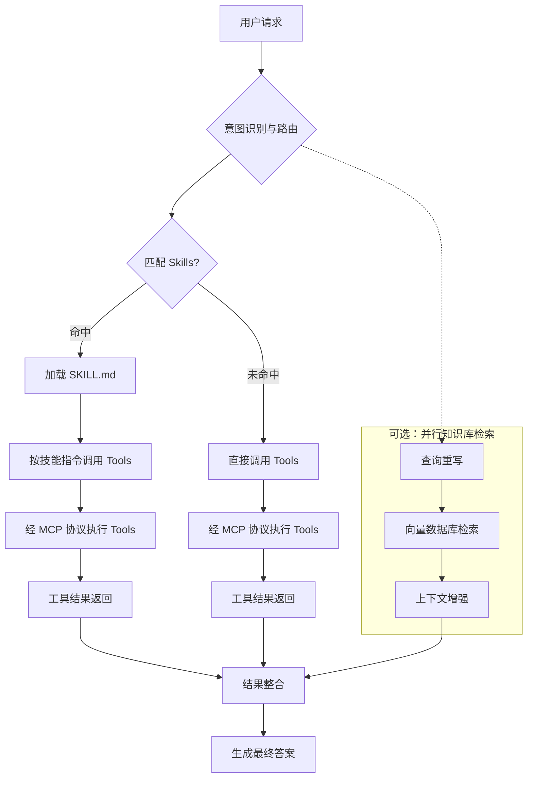

<!-- 模块：Agent 架构与协同 | 最后更新于 2026-05-28 -->

# Agent 架构与协同

> ReAct、@Tool、Skills/Tools/MCP 与 RAG 协同。

## 目录

- [ReAct 与 Transformer 架构的区别](#react-与-transformer-架构的区别)
- [Agent 与 RAG 协同 @Tool 动态加载](#agent-与-rag-协同-tool-动态加载)
- [Skills、Tools、MCP 与知识库协同流程（含数据库场景）](#skillstoolsmcp-与知识库协同流程含数据库场景)
- [Agent 流水线中的并行知识库检索](#agent-流水线中的并行知识库检索)

---
## ReAct 与 Transformer 架构的区别

> **模块**：Agent 架构与协同 | **标签**：Agent与对话 | **更新**：2026-05-28

### 核心概念

两者处于**不同抽象层次**：ReAct 是智能体工作范式，Transformer 是底层神经网络架构。

### 要点

两者处于**不同抽象层次**：ReAct 是智能体工作范式，Transformer 是底层神经网络架构。

| 对比维度 | Transformer 架构 | ReAct 模式 |
| :--- | :--- | :--- |
| 定义 | 基于自注意力机制的神经网络，LLM 的基础 | 推理与行动结合的提示策略（Reasoning + Acting） |
| 目的 | 捕捉长距离依赖，语义理解与生成 | 通过「思考→行动→观察」循环调用外部工具 |
| 运行逻辑 | 一次性计算预测输出 | 迭代循环：思考 → 行动 → 观察 |
| 对外交互 | 无（知识止于训练数据） | 有（搜索引擎、API、计算器等） |
| 典型应用 | GPT、BERT、T5 等大模型基础 | AutoGPT、智能客服、数据分析 Agent |

**协同关系**：ReAct 实现中，Transformer 架构的大模型充当「思考」引擎；模型决定行动，外部系统执行后将观察结果返回，开始下一轮循环。

**类比**：Transformer 是发动机（提供动力），ReAct 是智能驾驶系统（规划路线、调用工具、达成目标）。

### 面试常问

**问**：ReAct 模式与 Transformer 架构有什么区别？两者如何协同？

**答**：两者处于**不同抽象层次**：ReAct 是智能体工作范式，Transformer 是底层神经网络架构。 Transformer 架构 :--- 基于自注意力机制的神经网络，LLM 的基础 捕捉长距离依赖，语义理解与生成 一次性计算预测输出 无（知识止于训练数据） GPT、BERT、T5 等大模型基础 **协同关系**：ReAct 实现中，Transformer 架构的大模型充当「思考」引擎；模型决定行动，外部系统执行后将观察结果返回，…

### 关联知识点

- [Agent 工作流模式](Agent工作流模式.md)
- [RAG 检索策略](RAG检索策略.md)

---
## Agent 与 RAG 协同 @Tool 动态加载

> **模块**：Agent 架构与协同 | **标签**：Agent与对话 | **更新**：2026-05-28

### 核心概念

将 RAG 检索封装为 `@Tool` 方法（含 name、description），返回拼接后的 Document 文本。

### 要点

- 将 RAG 检索封装为 `@Tool` 方法（含 name、description），返回拼接后的 Document 文本。
- 通过 `KnowledgeToolRegistry` 收集 Spring 容器中所有 `@Tool` Bean。
- `ChatClient.defaultTools()` 注入后，由 LLM 根据工具描述自主决定是否调用知识库。

### 代码示例

```java
@Component
public class ProductDocumentTool {
    @Tool(name = "query_product_docs", 
         description = "查询产品功能、配置、API使用方法的官方文档知识库。")
    public String queryProductDocs(@ToolParam(description = "用户关于产品的具体问题") String query) {
        List<Document> docs = vectorStore.similaritySearch(SearchRequest.query(query).withTopK(3));
        return docs.stream().map(Document::getContent).collect(Collectors.joining("\n---\n"));
    }
}

@Service
public class KnowledgeToolRegistry {
    @Autowired
    private List<Object> allTools;
    private Map<String, Object> toolMap = new ConcurrentHashMap<>();
    
    @PostConstruct
    public void init() {
        for (Object tool : allTools) {
            // 通过反射获取 @Tool 注解的方法名注册
            toolMap.put(tool.getClass().getSimpleName(), tool);
        }
    }
    
    public Object[] getAllToolInstances() {
        return toolMap.values().toArray();
    }
}

// 配置 ChatClient
@Bean
public ChatClient agentChatClient(ChatClient.Builder builder) {
    return builder
        .defaultSystem("你是一个智能助手，优先使用知识库工具回答问题。")
        .defaultTools(toolRegistry.getAllToolInstances())
        .build();
}
```

### 面试常问

**问**：如何让 Agent 动态决定是否调用 RAG 检索？请给出使用 @Tool 注解并动态加载工具的设计。

**答**：将 RAG 检索封装为 `@Tool` 方法（含 name、description），返回拼接后的 Document 文本。；通过 `KnowledgeToolRegistry` 收集 Spring 容器中所有 `@Tool` Bean。；`ChatClient.defaultTools()` 注入后，由 LLM 根据工具描述自主决定是否调用知识库。。

### 关联知识点

- [Agent 工作流模式](Agent工作流模式.md)
- [RAG 检索策略](RAG检索策略.md)

---
## Skills、Tools、MCP 与知识库协同流程（含数据库场景）

> **模块**：Agent 架构与协同 | **标签**：Agent与对话 | **更新**：2026-05-28

### 核心概念

协作本质为 **意图路由 → 技能匹配 → 工具调用与知识检索并行 → 结果整合 → 生成答案**。

### 要点

协作本质为 **意图路由 → 技能匹配 → 工具调用与知识检索并行 → 结果整合 → 生成答案**。

**核心组件定位**（以操作数据库为例）：

| 组件 | 角色与定位 |
| :--- | :--- |
| **知识库 (RAG)** | **静态数据源**。向量检索提供上下文；库中常存业务知识、Schema 元数据、历史查询模板 |
| **Tools** | **原子动作**。可执行 SQL、调 API、发邮件等，是可执行逻辑的最小单元 |
| **MCP** | **标准化工具连接协议**。统一模型与外部工具/数据源的接入方式，解决多系统适配 |
| **Skills** | **可复用任务工作流**。封装完成特定业务所需的 Tools、知识与步骤；如「查询数据库」Skill 含 MCP `execute_sql` 与相关 Schema 知识 |

**角色分工**（餐厅类比）：

| 组件 | 角色 |
| :--- | :--- |
| **知识库 (RAG)** | 菜谱与食材手册，提供静态参考知识 |
| **MCP** | 标准化厨房设备接口，厨具即插即用 |
| **Tools** | 具体厨具（炒锅、烤箱），执行具体操作 |
| **Skills** | 标准化菜品 SOP（如宫保鸡丁制作流程） |

**五步流程**：

1. **意图识别与路由**：分析自然语言请求（如「查询上海地区销售数据」），判断需调用哪些能力；以 Skills 元数据（名称、描述）为主要决策依据。
2. **匹配 Skills 获取任务流**：在注册表中匹配合适技能，命中后加载 `SKILL.md`（明确 Tools、参数与操作步骤）。
3. **执行 Tools（经 MCP）**：按 `SKILL.md` 或模型决策调用 Tools；数据库类 Tool 经 MCP 客户端向服务端发起；**RAG 检索与此并行**（见 RAG 专题）。
4. **结果整合**：`execute_sql` 等 Tool 返回数据集与 RAG 返回的数据字典说明等一并进入上下文窗口。
5. **生成最终答案**：模型综合 Tool 输出与检索上下文生成回答。

**分支逻辑**：命中 Skill 时先加载指令再调 Tool；未命中则模型直接选择并调用 Tools，同样经 MCP 执行。

### 代码示例



### 面试常问

**问**：Spring AI 智能体操作数据库时，Skills、Tools、MCP 与知识库（RAG）如何协同？匹配与执行顺序是什么？

**答**：协作本质为 **意图路由 → 技能匹配 → 工具调用与知识检索并行 → 结果整合 → 生成答案**。 **核心组件定位**（以操作数据库为例）： 角色与定位 :--- **静态数据源**。向量检索提供上下文；库中常存业务知识、Schema 元数据、历史查询模板 **Tools** **标准化工具连接协议**。统一模型与外部工具/数据源的接入方式，解决多系统适配 **Skills** **角色分工**（餐厅类比）： 角色 :--- 菜谱与…

### 关联知识点

- [Agent 工作流模式](Agent工作流模式.md)
- [RAG 检索策略](RAG检索策略.md)

---
## Agent 流水线中的并行知识库检索

> **模块**：Agent 架构与协同 | **标签**：RAG检索增强 | **更新**：2026-05-28

### 核心概念

触发时机：意图识别与路由阶段即可启动，与 Skill 匹配、MCP 工具调用**并行**，不阻塞 `execute_sql` 等 Tool 执行。

### 要点

- **触发时机**：意图识别与路由阶段即可启动，与 Skill 匹配、MCP 工具调用**并行**，不阻塞 `execute_sql` 等 Tool 执行。
- **子流程三步**：
  1. **查询重写**：将用户自然语言转为更适合检索的查询（消歧、补全表名/字段等实体）。
  2. **向量数据库检索**：Embedding 相似度召回相关文档片段。
  3. **上下文增强**：将检索结果整理为可注入 Prompt 的上下文块。
- **典型库内容**（数据库场景）：业务知识说明、**Schema 元数据**、历史查询模板、数据字典条目。
- **结果汇入**：增强后的上下文与 Tool 执行结果（如 `execute_sql` 查询数据集）在**结果整合**阶段一并进入模型上下文。
- **价值**：Tool 提供动态/实时查询结果，RAG 提供静态参考（表结构、字段含义、业务规则），二者互补后生成更准确的 SQL 与解释性回答。

### 面试常问

**问**：Spring AI 智能体操作数据库时，RAG 知识库如何在 Skills/Tools 执行的同时并行参与？子流程与典型存储内容是什么？

**答**：触发时机：意图识别与路由阶段即可启动，与 Skill 匹配、MCP 工具调用并行**，不阻塞 `execute_sql` 等 Tool 执行。；子流程三步**：；典型库内容（数据库场景）：业务知识说明、Schema 元数据**、历史查询模板、数据字典条目。；结果汇入：增强后的上下文与 Tool 执行结果（如 `execute_sql` 查询数据集）在结果整合**阶段一并进入模型上下文。。

### 关联知识点

- [Agent 工作流模式](Agent工作流模式.md)
- [RAG 检索策略](RAG检索策略.md)

---