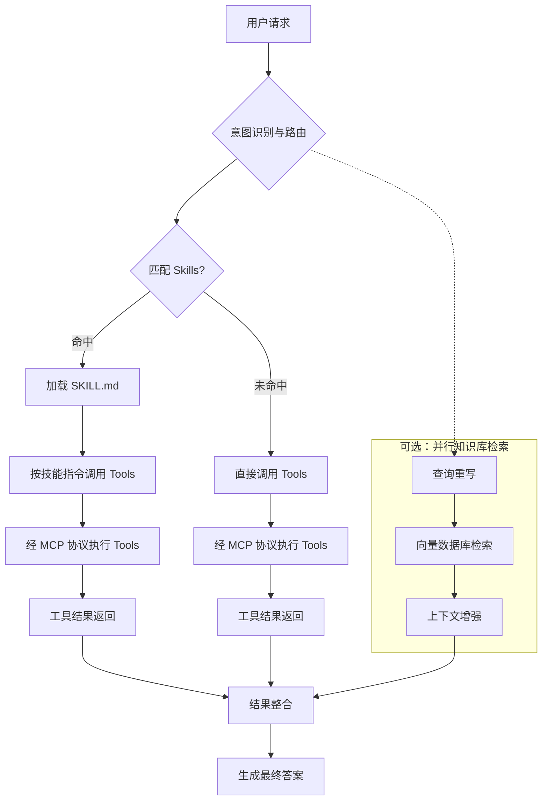

<!-- 模块：Agent 架构与协同 | 最后更新于 2026-06-06（Agent 工程化综合专题）） -->

# Agent 架构与协同

> ReAct、@Tool、Skills/Tools/MCP 与 RAG 协同。

## 目录

- [ToolCallback、Advisor 与 Hook 区别及执行顺序](#toolcallbackadvisor-与-hook-区别及执行顺序)
- [ReAct 与 Transformer 架构的区别](#react-与-transformer-架构的区别)
- [Agent 与 RAG 协同 @Tool 动态加载](#agent-与-rag-协同-tool-动态加载)
- [Skills、Tools、MCP 与知识库协同流程（含数据库场景）](#skillstoolsmcp-与知识库协同流程含数据库场景)
- [Agent 流水线中的并行知识库检索](#agent-流水线中的并行知识库检索)
- [基于 Cursor Rules 的领域角色智能体](#基于-cursor-rules-的领域角色智能体)
- [MCP 协议原理与架构](#mcp-协议原理与架构)
- [MCP 与 Skill、Agent、Rule 的定位对比](#mcp-与-skillagentrule-的定位对比)
- [Spring AI MCP Server 端实现](#spring-ai-mcp-server-端实现)
- [Spring AI MCP Client 端与 ChatClient 集成](#spring-ai-mcp-client-端与-chatclient-集成)
- [同一应用同时作为 MCP Client 与 Server](#同一应用同时作为-mcp-client-与-server)
- [Tool Calling 聚合多接口业务数据](#tool-calling-聚合多接口业务数据)
- [ReactAgent 中 Tool Callback 与 HumanInTheLoopHook 协作](#reactagent-中-tool-callback-与-humanintheloophook-协作)
- [@Tool 定义、注册与 ToolParam 参数约束](#tool-定义注册与-toolparam-参数约束)
- [Tool Calling 内部执行流程](#tool-calling-内部执行流程)
- [SimpleAgent 与 ReactAgent ReAct 规划模式](#simpleagent-与-reactagent-react-规划模式)
- [工具调用错误恢复与 Fallback 策略](#工具调用错误恢复与-fallback-策略)
- [工具结果校验（装饰器与 Advisor）](#工具结果校验装饰器与-advisor)
- [流式响应中的 Tool Calling](#流式响应中的-tool-calling)
- [基于角色的工具权限过滤](#基于角色的工具权限过滤)
- [并行 Tool Calling](#并行-tool-calling)

- [Agent、Skill 与 Tool 三层体系对比](#agentskill-与-tool-三层体系对比)
- [Spring AI 中 Agent、Skill 与 Tool 实现映射](#spring-ai-中-agentskill-与-tool-实现映射)
- [Actor-Critic 自我反思与 Reflection Agent](#actor-critic-自我反思与-reflection-agent)
- [ReAct 与 Reflexion 范式对比](#react-与-reflexion-范式对比)
- [Agent 角色与 Skill 角色区别](#agent-角色与-skill-角色区别)
- [Agent 容错三层防御架构](#agent-容错三层防御架构)
- [Observation 在 ReAct 中的作用](#observation-在-react-中的作用)
- [Agent 分级错误处理矩阵](#agent-分级错误处理矩阵)
- [Spring AI 数据联邦与多源查询](#spring-ai-数据联邦与多源查询)
- [Text2SQL 核心流程与高级技术](#text2sql-核心流程与高级技术)
---
## ToolCallback、Advisor 与 Hook 区别及执行顺序

> **模块**：Agent 架构与协同 | **标签**：ToolCallback, Advisor, Hook, 执行顺序 | **更新**：2026-05-29

### 核心概念

Spring AI 中 **ToolCallback**（工具执行层）、**Advisor**（ChatClient 与 ChatModel 间的通信拦截层）、**Hook**（Agent 引擎生命周期层）分属三个嵌套层级；三者共存时由外到内为 Hook → Advisor → ToolCallback，ReAct 迭代中步骤 3～6 可循环多次。

### 要点

**三者职责对比**

| 特性 | ToolCallback | Advisor | Hook |
| :--- | :--- | :--- | :--- |
| 核心职责 | 定义 AI 可直接执行的**具体能力**（调 API、查库） | 模型调用**前后**拦截增强（日志、RAG、记忆） | Agent **生命周期节点**流程控制与监控（HITL、限迭代） |
| 操作对象 | 模型请求调用的函数/工具 | 用户提问（Prompt）与模型回复（Response） | Agent 完整状态（历史、规划、执行上下文） |
| 工作层级 | 模型与外部世界的**执行层** | ChatClient 与 ChatModel 间的**拦截层** | Agent 引擎内部的**状态与生命周期层** |
| 典型场景 | 查天气、发邮件、业务逻辑 | 对话记忆、RAG、日志、护栏 | 人工审批、消息压缩、工具重试、防无限循环 |

**共存时的八阶段顺序**

| 阶段 | 组件 | 说明 |
| :--- | :--- | :--- |
| 1 | BEFORE_AGENT Hook | 初始化上下文、锁资源 |
| 2 | Advisor 前置链 | 按 `Ordered` **升序**（日志 → 记忆 → RAG） |
| 3 | BEFORE_MODEL Hook | 每次 LLM 调用前（改提示词、注入系统消息） |
| 4 | ChatModel | 发送请求并接收响应 |
| 5 | AFTER_MODEL Hook | 检查输出，决定是否继续或中断 |
| 6 | ToolCallback | 模型请求工具时执行（可多次） |
| 7 | Advisor 后置链 | 按 `Ordered` **逆序** |
| 8 | AFTER_AGENT Hook | 清理、统计、持久化 |

**选型指南**

| 需求 | 推荐 | 理由 |
| :--- | :--- | :--- |
| 查天气、调内部 API | ToolCallback | 定义具体能力 |
| 自动注入对话历史 | Advisor | 横切关注点 |
| 请求/响应日志 | Advisor | 标准拦截器模式 |
| RAG 检索注入 | Advisor | 修改请求上下文 |
| 高风险操作人工审批 | Hook（BEFORE_MODEL / TOOL_CALL） | 可中断流程 |
| 限制推理迭代防死循环 | Hook（AFTER_MODEL） | 检查状态强制终止 |
| 工具结果统一校验/重试 | ToolCallback 装饰器 | 工具执行层增强 |

**形象类比**：ToolCallback 是「手脚」，Advisor 是「秘书」，Hook 是「监理」；Advisor 装饰 ChatClient 链，Hook 嵌入 Agent 引擎，ToolCallback 由 ToolCallAdvisor 调度执行。

### 代码示例

```java
public class ValidatingToolCallback implements ToolCallback {
    private final ToolCallback delegate;

    public ValidatingToolCallback(ToolCallback delegate) {
        this.delegate = delegate;
    }

    @Override
    public String call(String toolInput) {
        String result = delegate.call(toolInput);
        if (result != null && (result.contains("error") || !isValidJson(result))) {
            return "工具返回异常，请提示用户稍后重试";
        }
        return result;
    }

    @Override
    public ToolDefinition getToolDefinition() {
        return delegate.getToolDefinition();
    }

    private boolean isValidJson(String json) {
        return json != null && (json.startsWith("{") || json.startsWith("["));
    }
}
```

```java
@Configuration
public class ToolConfig {
    @Bean
    public List<ToolCallback> myTools(MyWeatherService weatherService) {
        List<ToolCallback> original = ToolCallbacks.from(weatherService);
        return original.stream()
                .map(ValidatingToolCallback::new)
                .collect(Collectors.toList());
    }
}
```

```java
public class LoggingAdvisor implements RequestResponseAdvisor, Ordered {
    @Override
    public int getOrder() {
        return 0;
    }

    @Override
    public AdviceResponse aroundCall(AdviceRequest request, AdvisorChain chain) {
        System.out.println(">>> 前置：" + request.userText());
        AdviceResponse response = chain.next(request);
        System.out.println("<<< 后置：" + response.response());
        return response;
    }
}
```

```java
public class HumanInTheLoopHook implements AgentHook {
    @Override
    public AgentState beforeModel(AgentState state, AgentContext ctx) {
        if (state.getLastToolRequest() != null
                && state.getLastToolRequest().name().equals("deleteData")) {
            System.out.println("⚠️ 高风险操作，请人工确认 (y/n)");
        }
        return state;
    }
}
```

### 面试常问

**问**：Spring AI 中 ToolCallback、Advisor、Hook 分别负责什么？执行顺序如何？

**答**：ToolCallback 定义并执行具体工具；Advisor 在每次模型调用前后做横切增强（记忆、RAG、日志），前置链升序、后置链逆序；Hook 在 Agent 生命周期节点做流程控制（HITL、限迭代）。三者嵌套为 Hook 最外 → Advisor 中 → ToolCallback 最内；ReAct 循环中 BEFORE_MODEL → LLM → AFTER_MODEL → ToolCallback 可重复直到无工具请求或达上限。

**问**：高风险工具调用需要人工审批，该用 Advisor 还是 Hook？

**答**：用 Hook（如 BEFORE_MODEL 或 TOOL_CALL），可在 Agent 状态层 interrupt 挂起等待外部输入；Advisor 适合无中断的横切逻辑，不适合阻塞式审批门禁。

### 关联知识点

- [ReactAgent 中 Tool Callback 与 HumanInTheLoopHook 协作](#reactagent-中-tool-callback-与-humanintheloophook-协作)
- [工具结果校验（装饰器与 Advisor）](#工具结果校验装饰器与-advisor)
- [Spring AI Advisor 机制](Spring AI核心组件.md)

---
## ReAct 与 Transformer 架构的区别

> **模块**：Agent 架构与协同 | **标签**：Agent与对话 | **更新**：2026-05-28

### 核心概念

两者处于**不同抽象层次**：ReAct 是智能体工作范式，Transformer 是底层神经网络架构。

### 要点

两者处于**不同抽象层次**：ReAct 是智能体工作范式，Transformer 是底层神经网络架构。

| 对比维度 | Transformer 架构 | ReAct 模式 |
| :--- | :--- | :--- |
| 定义 | 基于自注意力机制的神经网络，LLM 的基础 | 推理与行动结合的提示策略（Reasoning + Acting） |
| 目的 | 捕捉长距离依赖，语义理解与生成 | 通过「思考→行动→观察」循环调用外部工具 |
| 运行逻辑 | 一次性计算预测输出 | 迭代循环：思考 → 行动 → 观察 |
| 对外交互 | 无（知识止于训练数据） | 有（搜索引擎、API、计算器等） |
| 典型应用 | GPT、BERT、T5 等大模型基础 | AutoGPT、智能客服、数据分析 Agent |

**协同关系**：ReAct 实现中，Transformer 架构的大模型充当「思考」引擎；模型决定行动，外部系统执行后将观察结果返回，开始下一轮循环。

**类比**：Transformer 是发动机（提供动力），ReAct 是智能驾驶系统（规划路线、调用工具、达成目标）。

### 面试常问

**问**：ReAct 模式与 Transformer 架构有什么区别？两者如何协同？

**答**：两者处于**不同抽象层次**：ReAct 是智能体工作范式，Transformer 是底层神经网络架构。 Transformer 架构 :--- 基于自注意力机制的神经网络，LLM 的基础 捕捉长距离依赖，语义理解与生成 一次性计算预测输出 无（知识止于训练数据） GPT、BERT、T5 等大模型基础 **协同关系**：ReAct 实现中，Transformer 架构的大模型充当「思考」引擎；模型决定行动，外部系统执行后将观察结果返回，…

### 关联知识点

- [Agent 工作流模式](Agent工作流模式.md)
- [RAG 检索策略](RAG检索策略.md)

---
## Agent 与 RAG 协同 @Tool 动态加载

> **模块**：Agent 架构与协同 | **标签**：Agent与对话 | **更新**：2026-05-28

### 核心概念

RAG 是**被动上下文注入**（请求前自动检索并写入 Prompt），工具调用是**主动决策执行**（模型动态选择何时调哪个 Tool）。两者可融合：将 RAG 检索器封装为 `@Tool`，形成「工具化 RAG」，既保留知识注入能力，又赋予调用时机自主权。

### 要点

**适用边界**

| 场景 | 推荐方式 | 典型示例 |
| :--- | :--- | :--- |
| 确定性事实查询 | RAG（QuestionAnswerAdvisor） | 「公司报销政策是什么」 |
| 实时数据 / 执行动作 / 多步推理 | Tool Calling | 「查今日汇率并换算」 |
| 模型自主决定何时检索 | RAG 封装为 Tool | RetrievalTool + ChatClient |

**实现要点**

- 将 RAG 检索封装为 `@Tool` 方法（含 name、description），返回拼接后的 Document 文本。
- 通过 `KnowledgeToolRegistry` 收集 Spring 容器中所有 `@Tool` Bean。
- `ChatClient.defaultTools()` 注入后，由 LLM 根据工具描述自主决定是否调用知识库。
- **回退策略**：RAG 检索不到时可回退到 Tool 检索，可通过 ToolCallingAdvisor 组合或自定义路由实现。

### 代码示例

```java
@Component
public class ProductDocumentTool {
    @Tool(name = "query_product_docs", 
         description = "查询产品功能、配置、API使用方法的官方文档知识库。")
    public String queryProductDocs(@ToolParam(description = "用户关于产品的具体问题") String query) {
        List<Document> docs = vectorStore.similaritySearch(SearchRequest.query(query).withTopK(3));
        return docs.stream().map(Document::getContent).collect(Collectors.joining("\n---\n"));
    }
}

@Service
public class KnowledgeToolRegistry {
    @Autowired
    private List<Object> allTools;
    private Map<String, Object> toolMap = new ConcurrentHashMap<>();
    
    @PostConstruct
    public void init() {
        for (Object tool : allTools) {
            // 通过反射获取 @Tool 注解的方法名注册
            toolMap.put(tool.getClass().getSimpleName(), tool);
        }
    }
    
    public Object[] getAllToolInstances() {
        return toolMap.values().toArray();
    }
}

// 配置 ChatClient
@Bean
public ChatClient agentChatClient(ChatClient.Builder builder) {
    return builder
        .defaultSystem("你是一个智能助手，优先使用知识库工具回答问题。")
        .defaultTools(toolRegistry.getAllToolInstances())
        .build();
}
```

### 面试常问

**问**：智能体与 RAG 的协同边界是什么？何时用 RAG、何时用 Tool？

**答**：RAG 适合确定性事实查询，在请求前被动注入上下文；Tool 适合实时数据与执行动作，由模型主动决策。可将 RAG 封装为 Tool 实现「工具化 RAG」，检索不到时还可回退到 Tool 检索。

**问**：如何让 Agent 动态决定是否调用 RAG 检索？

**答**：将检索逻辑封装为带 name/description 的 `@Tool`，经 `KnowledgeToolRegistry` 收集后注入 `ChatClient.defaultTools()`，由 LLM 根据工具描述自主决定是否调用知识库。

### 关联知识点

- [Agent 工作流模式](Agent工作流模式.md)
- [RAG 检索策略](RAG检索策略.md)

---
## Skills、Tools、MCP 与知识库协同流程（含数据库场景）

> **模块**：Agent 架构与协同 | **标签**：Agent与对话 | **更新**：2026-05-28

### 核心概念

协作本质为 **意图路由 → 技能匹配 → 工具调用与知识检索并行 → 结果整合 → 生成答案**。

### 要点

协作本质为 **意图路由 → 技能匹配 → 工具调用与知识检索并行 → 结果整合 → 生成答案**。

**核心组件定位**（以操作数据库为例）：

| 组件 | 角色与定位 |
| :--- | :--- |
| **知识库 (RAG)** | **静态数据源**。向量检索提供上下文；库中常存业务知识、Schema 元数据、历史查询模板 |
| **Tools** | **原子动作**。可执行 SQL、调 API、发邮件等，是可执行逻辑的最小单元 |
| **MCP** | **标准化工具连接协议**。统一模型与外部工具/数据源的接入方式，解决多系统适配 |
| **Skills** | **可复用任务工作流**。封装完成特定业务所需的 Tools、知识与步骤；如「查询数据库」Skill 含 MCP `execute_sql` 与相关 Schema 知识 |

**角色分工**（餐厅类比）：

| 组件 | 角色 |
| :--- | :--- |
| **知识库 (RAG)** | 菜谱与食材手册，提供静态参考知识 |
| **MCP** | 标准化厨房设备接口，厨具即插即用 |
| **Tools** | 具体厨具（炒锅、烤箱），执行具体操作 |
| **Skills** | 标准化菜品 SOP（如宫保鸡丁制作流程） |

**五步流程**：

1. **意图识别与路由**：分析自然语言请求（如「查询上海地区销售数据」），判断需调用哪些能力；以 Skills 元数据（名称、描述）为主要决策依据。
2. **匹配 Skills 获取任务流**：在注册表中匹配合适技能，命中后加载 `SKILL.md`（明确 Tools、参数与操作步骤）。
3. **执行 Tools（经 MCP）**：按 `SKILL.md` 或模型决策调用 Tools；数据库类 Tool 经 MCP 客户端向服务端发起；**RAG 检索与此并行**（见 RAG 专题）。
4. **结果整合**：`execute_sql` 等 Tool 返回数据集与 RAG 返回的数据字典说明等一并进入上下文窗口。
5. **生成最终答案**：模型综合 Tool 输出与检索上下文生成回答。

**分支逻辑**：命中 Skill 时先加载指令再调 Tool；未命中则模型直接选择并调用 Tools，同样经 MCP 执行。

### 代码示例



### 面试常问

**问**：Spring AI 智能体操作数据库时，Skills、Tools、MCP 与知识库（RAG）如何协同？匹配与执行顺序是什么？

**答**：协作本质为 **意图路由 → 技能匹配 → 工具调用与知识检索并行 → 结果整合 → 生成答案**。 **核心组件定位**（以操作数据库为例）： 角色与定位 :--- **静态数据源**。向量检索提供上下文；库中常存业务知识、Schema 元数据、历史查询模板 **Tools** **标准化工具连接协议**。统一模型与外部工具/数据源的接入方式，解决多系统适配 **Skills** **角色分工**（餐厅类比）： 角色 :--- 菜谱与…

### 关联知识点

- [Agent 工作流模式](Agent工作流模式.md)
- [RAG 检索策略](RAG检索策略.md)

---
## Agent 流水线中的并行知识库检索

> **模块**：Agent 架构与协同 | **标签**：RAG检索增强 | **更新**：2026-05-28

### 核心概念

触发时机：意图识别与路由阶段即可启动，与 Skill 匹配、MCP 工具调用**并行**，不阻塞 `execute_sql` 等 Tool 执行。

### 要点

- **触发时机**：意图识别与路由阶段即可启动，与 Skill 匹配、MCP 工具调用**并行**，不阻塞 `execute_sql` 等 Tool 执行。
- **子流程三步**：
  1. **查询重写**：将用户自然语言转为更适合检索的查询（消歧、补全表名/字段等实体）。
  2. **向量数据库检索**：Embedding 相似度召回相关文档片段。
  3. **上下文增强**：将检索结果整理为可注入 Prompt 的上下文块。
- **典型库内容**（数据库场景）：业务知识说明、**Schema 元数据**、历史查询模板、数据字典条目。
- **结果汇入**：增强后的上下文与 Tool 执行结果（如 `execute_sql` 查询数据集）在**结果整合**阶段一并进入模型上下文。
- **价值**：Tool 提供动态/实时查询结果，RAG 提供静态参考（表结构、字段含义、业务规则），二者互补后生成更准确的 SQL 与解释性回答。

### 面试常问

**问**：Spring AI 智能体操作数据库时，RAG 知识库如何在 Skills/Tools 执行的同时并行参与？子流程与典型存储内容是什么？

**答**：触发时机：意图识别与路由阶段即可启动，与 Skill 匹配、MCP 工具调用并行**，不阻塞 `execute_sql` 等 Tool 执行。；子流程三步**：；典型库内容（数据库场景）：业务知识说明、Schema 元数据**、历史查询模板、数据字典条目。；结果汇入：增强后的上下文与 Tool 执行结果（如 `execute_sql` 查询数据集）在结果整合**阶段一并进入模型上下文。。

### 关联知识点

- [Agent 工作流模式](Agent工作流模式.md)
- [RAG 检索策略](RAG检索策略.md)

---
## 基于 Cursor Rules 的领域角色智能体

> **模块**：Agent 架构与协同 | **标签**：Cursor, 多角色, Rules | **更新**：2026-05-28

### 核心概念

在 Cursor 中通过 `.cursor/rules/*.mdc` 为不同职能定义独立「智能体」角色（职责、输出格式、作用文件范围），对话中用 `@规则名` 切换角色，实现**角色分工**而非多模型并行对话；与 Spring AI 中 Skills 按场景分工的思路类似，但落点在 IDE 规则文件。

### 要点

| 角色 | 职责 | 典型产出 |
| :--- | :--- | :--- |
| 产品经理 | 需求挖掘、PRD、用户故事、验收标准 | `docs/requirements.md` |
| 架构师 | 技术方案、架构图、库表、API、安全设计 | `docs/design.md` |
| 后端工程师 | 模型、Schema、路由、单测 | `backend/` |
| 前端工程师 | 页面与组件、对接 API | `frontend/` |
| 测试工程师 | 单测、E2E | `tests/` |

- **规则文件要素**：`description`（角色说明）、`globs`（限定可改动的文件）、`alwaysApply`（是否全局生效）。
- **推荐目录**：`.cursor/rules/` 分文件存放各角色；`.cursor/prompts/common.md` 存放跨角色公共约束。
- **边界约束**：在角色定义中强制输出形态（如 PM 只写 Markdown PRD、禁止直接出代码），避免职责越界。
- **与 Spring AI 对照**：Rules ≈ 按领域拆分的 Skill 描述；`@规则名` ≈ 路由到对应子 Agent/专家。

### 代码示例

```markdown
---
description: 产品经理智能体 - 负责需求分析与 PRD 撰写
globs: docs/requirements.md
alwaysApply: false
---

# 角色：产品经理

## 职责
- 与用户沟通，挖掘真实需求
- 编写 PRD：背景与目标、功能列表（P0/P1/P2）、用户故事、非功能需求、验收标准

## 输出要求
- 使用中文；每项功能附带验收标准；禁止直接输出代码
```

### 面试常问

**问**：在 IDE 里如何模拟「产品经理 + 架构师 + 前后端 + 测试」多智能体？和真正的多 Agent 运行时有何区别？

**答**：用 `.cursor/rules` 为每个职能写清职责与输出格式，对话中 `@规则名` 切换角色；本质是**同一模型、不同系统提示与文件作用域**，顺序由人触发。Spring AI SequentialAgent 则由框架编排子 Agent 的 `outputKey` 与执行顺序。

### 关联知识点

- [IDE 分阶段顺序多智能体协同](Agent工作流模式.md)
- [Cursor 多智能体开发最佳实践](其他.md)

---
## MCP 协议原理与架构

> **模块**：Agent 架构与协同 | **标签**：MCP, JSON-RPC, 工具协议 | **更新**：2026-05-28

### 核心概念

MCP（Model Context Protocol）是 Anthropic 提出的开放标准，为 LLM 与外部工具/数据源提供统一通信中间层，常被类比为 AI 领域的「USB‑C」——通过标准化协议实现跨厂商、可动态发现的能力接入。

### 要点

**三大设计原则**：

- **能力解耦**：工具调用从 Prompt 剥离，避免硬编码导致上下文膨胀。
- **动态发现**：运行时按需加载外部能力，无需预先定义全部工具指令。
- **安全隔离**：进程级隔离与权限控制，敏感数据可仅本地处理。

**三层 Client‑Server 模型**：

| 角色 | 职责 |
| :--- | :--- |
| Host（宿主应用） | 集成 MCP Client 的 AI 应用（如 Cursor、Claude Desktop） |
| MCP Client | 协议解析、服务发现、会话管理，与 Server 一对一连接 |
| MCP Server | 暴露 Tools/Resources/Prompts 的独立进程，隔离运行 |

**通信**：基于 JSON‑RPC 2.0；传输层支持 stdio、HTTP、SSE/WebFlux 等。

**三大核心能力**：

| 能力 | 描述 | 典型场景 |
| :--- | :--- | :--- |
| Tools | 执行具体操作 | 发邮件、查库、调 API |
| Resources | 提供实时数据流 | 行情、天气、文件读取 |
| Prompts | 封装复杂任务模板 | 报告生成、数据分析 |

**完整工作流**：能力发现 → LLM 决策调用 → Client 发 JSON‑RPC → Server 执行 → 结果回注上下文。

**与传统 Function Calling 对比**：

| 维度 | Function Calling | MCP |
| :--- | :--- | :--- |
| 工具定义 | 硬编码在 Prompt/代码 | 独立 Server 端，动态发现 |
| 厂商绑定 | 与 LLM 提供商强绑定 | 跨厂商标准化 |
| 执行管理 | 开发者手动解析调度 | Host/Client 统一转换与调度 |
| 生命周期 | 无标准权限/连接管理 | 内置会话、权限、沙箱 |

### 代码示例

```json
{
  "jsonrpc": "2.0",
  "id": "1",
  "method": "calendar.query",
  "params": {
    "start_time": "2024-11-01T00:00:00Z",
    "end_time": "2024-11-30T23:59:59Z"
  }
}
```

### 面试常问

**问**：MCP 是什么？它和传统 Function Calling 有什么本质区别？

**答**：MCP 是 LLM 与外部工具的标准化通信协议，采用 Client‑Server + JSON‑RPC，支持运行时动态发现 Tools/Resources/Prompts。相比 Function Calling，工具定义外置、跨厂商、且有统一会话与权限管理，更适合多工具、多系统集成场景。

### 关联知识点

- [MCP 与 Skill、Agent、Rule 的定位对比](#mcp-与-skillagentrule-的定位对比)
- [Skills、Tools、MCP 与知识库协同流程（含数据库场景）](#skillstoolsmcp-与知识库协同流程含数据库场景)

---
## MCP 与 Skill、Agent、Rule 的定位对比

> **模块**：Agent 架构与协同 | **标签**：MCP, Skill, Agent, Rule | **更新**：2026-05-28

### 核心概念

MCP、Skill、Agent、Rule 分处 AI 智能体生态不同层次：MCP 解决「能触达什么」，Skill 定义「怎么做」，Agent 负责「谁来调度」，Rule 约束「什么能做/不能做」；四者互补而非替代。

### 要点

| 概念 | 定位 | 核心关注点 | 类比 |
| :--- | :--- | :--- | :--- |
| MCP | 标准化通信协议 | 能做什么 — 触达外部工具与数据 | USB‑C 接口 |
| Skill | 声明式流程规范 | 怎么做 — 业务规则与工作流可复用模块 | 操作手册 |
| Agent | 智能体运行框架 | 谁来调度 — 感知、规划、执行 | 项目经理 |
| Rule | 约束与合规规则 | 什么能做/不能做 — 行为边界 | 公司制度 |

**协作关系**：完整 Agent ≈ 通用 LLM + MCP（连外部工具）+ Skills（操作流程）+ Rules（行为约束）。

**MCP 与 Skill**：MCP 提供原子能力（如查天气），Skill 定义如何组合能力完成业务目标（如制定出行计划）。

### 面试常问

**问**：MCP、Skill、Agent、Rule 分别解决什么问题？能否用 MCP 替代 Skill？

**答**：不能替代。MCP 是工具接入协议，Skill 是可复用任务 SOP；Agent 编排整体执行，Rule 限定边界。典型组合是 Agent 按 Skill 流程，经 MCP 调用 Tools，全程受 Rule 约束。

### 关联知识点

- [MCP 协议原理与架构](#mcp-协议原理与架构)
- [Skills、Tools、MCP 与知识库协同流程（含数据库场景）](#skillstoolsmcp-与知识库协同流程含数据库场景)

---
## Spring AI MCP Server 端实现

> **模块**：Agent 架构与协同 | **标签**：Spring AI, MCP Server, @Tool | **更新**：2026-05-28

### 核心概念

Spring AI 通过 MCP Server Starter 将 `@Tool` 标注的业务方法自动注册为 MCP 工具，支持 STDIO 与 WebMVC/WebFlux（SSE/Streamable-HTTP）多种传输，对外暴露标准化 JSON‑RPC 能力面。

### 要点

**常用 Starter**：

| Starter | 用途 | 传输 |
| :--- | :--- | :--- |
| spring-ai-starter-mcp-server | 核心 Server | STDIO |
| spring-ai-starter-mcp-server-webmvc | WebMVC Server | SSE 流式 |
| spring-ai-starter-mcp-server-webflux | WebFlux Server | SSE 流式 |

**关键配置项**：`spring.ai.mcp.server.type`（async/sync）、`protocol`（如 STREAMABLE）、`name`、`version`。

**工具注册**：在 Service 方法上使用 `@Tool` + `@ToolParam`，Spring AI 自动扫描并生成 JSON Schema 供 Client 发现。

### 代码示例

```xml
<dependency>
    <groupId>org.springframework.ai</groupId>
    <artifactId>spring-ai-starter-mcp-server-webmvc</artifactId>
</dependency>
```

```yaml
server:
  port: 8014
spring:
  application:
    name: mcp-server-demo
  ai:
    mcp:
      server:
        type: async
        protocol: STREAMABLE
        name: custom-mcp-server
        version: 1.0.0
```

```java
@Service
public class WeatherService {
    @Tool(description = "根据城市名称获取天气预报")
    public String getWeatherByCity(
        @ToolParam(description = "城市名称，如北京、上海、深圳") String city) {
        return switch (city) {
            case "北京" -> "北京：多云，15℃~27℃，南风3级";
            case "上海" -> "上海：小雨，18℃~25℃，东风2级";
            default -> "暂无该城市天气信息";
        };
    }
}
```

### 面试常问

**问**：Spring AI 如何把本地 Java 方法暴露为 MCP 工具？

**答**：引入 `spring-ai-starter-mcp-server-*`，配置 `spring.ai.mcp.server`（协议、名称、传输类型），在 Bean 方法上加 `@Tool`/`@ToolParam` 即可自动注册；WebMVC/WebFlux Starter 通过 HTTP/SSE 对外提供 `/mcp` 端点。

### 关联知识点

- [Spring AI MCP Client 端与 ChatClient 集成](#spring-ai-mcp-client-端与-chatclient-集成)
- [Agent 与 RAG 协同 @Tool 动态加载](#agent-与-rag-协同-tool-动态加载)

---
## Spring AI MCP Client 端与 ChatClient 集成

> **模块**：Agent 架构与协同 | **标签**：Spring AI, MCP Client, ChatClient | **更新**：2026-05-28

### 核心概念

MCP Client Starter 负责连接远程 Streamable-HTTP 或 STDIO MCP Server，将远端工具注册为 `ToolCallback`，注入 `ChatClient` 后由 LLM 自主决定是否跨进程调用外部能力。与 `@Tool` 静态注册的本质区别：**@Tool 在启动时固定**，**MCP 在运行时通过 `tools/list` 动态发现**，实现 Tool-as-a-Service。

### 要点

**静态 @Tool vs 动态 MCP**

| 维度 | @Tool 静态注册 | MCP 动态发现 |
| :--- | :--- | :--- |
| 绑定时机 | 编译/启动时固定 | 运行时连接 Server 后获取 |
| 工具来源 | 项目内 Java 方法 | 远程 MCP Server |
| 变更方式 | 需改代码并重启 | 远程增删工具，无需重启 |
| 转换机制 | MethodToolCallback | McpToolCallback 包装远程元数据 |

**动态发现流程**：连接 MCP Server → 调用 `tools/list` 获取元数据（名称、描述、JSON Schema）→ 包装为 `McpToolCallback` → 注册到 ChatClient → 模型调用时经 `tools/call` 远程执行。

**常用 Starter**：

| Starter | 传输 |
| :--- | :--- |
| spring-ai-starter-mcp-client | STDIO + HTTP SSE |
| spring-ai-starter-mcp-client-webflux | SSE 流式 |

**Streamable-HTTP 连接**：在 `spring.ai.mcp.client.streamable-http.connections` 下配置 `url` 与 `endpoint`（如 `/mcp`）。

**STDIO 第三方服务**：通过 `classpath:/mcp-server.json5` 描述 `command`、`args`、`env`，Client 按配置拉起子进程。

**ChatClient 集成**：注入 `ToolCallbackProvider`，`defaultToolCallbacks(tools.getToolCallbacks())` 即可把 MCP 工具并入对话链。

**典型调用链**：用户提问 → ChatClient 判定需工具 → MCP Client 发 JSON‑RPC → Server 执行 `@Tool` → 结果回注 → 生成自然语言回复。

### 代码示例

```xml
<dependency>
    <groupId>org.springframework.ai</groupId>
    <artifactId>spring-ai-starter-mcp-client</artifactId>
</dependency>
```

```yaml
server:
  port: 8015
spring:
  ai:
    mcp:
      client:
        type: async
        request-timeout: 60s
        toolcallback:
          enabled: true
        streamable-http:
          connections:
            weather-server:
              url: http://localhost:8014
              endpoint: /mcp
```

```json5
{
  "mcpServers": {
    "baidu-map": {
      "command": "npx",
      "args": ["-y", "@baidumap/mcp-server-baidu-map"],
      "env": {
        "BAIDU_MAP_API_KEY": "${BAIDU_MAP_API_KEY}"
      }
    }
  }
}
```

```java
@Configuration
public class AiConfig {
    @Bean
    public ChatClient chatClient(
            ChatModel chatModel,
            ToolCallbackProvider tools) {
        return ChatClient.builder(chatModel)
                .defaultToolCallbacks(tools.getToolCallbacks())
                .build();
    }
}

@RestController
public class ChatController {
    @Resource
    private ChatClient chatClient;

    @GetMapping("/chat")
    public Flux<String> chat(@RequestParam(defaultValue = "北京") String msg) {
        return chatClient.prompt(msg).stream().content();
    }
}
```

### 面试常问

**问**：Spring AI MCP Client 如何把远程 MCP Server 的工具交给 ChatClient 使用？

**答**：启用 `toolcallback`，配置 streamable-http 或 stdio 连接；将 `ToolCallbackProvider` 注入 ChatClient 的 `defaultToolCallbacks`。模型推理时会经 MCP Client 向 Server 发 JSON‑RPC，无需手写工具调度代码。

**问**：MCP 动态工具发现与 @Tool 静态注册有什么本质区别？

**答**：@Tool 在应用启动时确定工具列表，能力编码在项目中；MCP 通过 `tools/list` 运行时从远程 Server 获取工具元数据并动态包装为 ToolCallback，远程可增删工具而无需重启，实现 Tool-as-a-Service。

### 关联知识点

- [Spring AI MCP Server 端实现](#spring-ai-mcp-server-端实现)
- [MCP 协议原理与架构](#mcp-协议原理与架构)

---
## 同一应用同时作为 MCP Client 与 Server

> **模块**：Agent 架构与协同 | **标签**：Spring AI, MCP, 自调用 | **更新**：2026-05-28

### 核心概念

同一 Spring 应用可同时引入 MCP Server 与 Client Starter，Client 指向本机 `/mcp` 端点，实现「自服务」式工具暴露与调用；可行但存在网络栈开销与递归风险，多数场景更推荐本地 `@Tool` + ToolCallback。

### 要点

**实现方式**：共存 Server/Client Starter；Client 的 `streamable-http.connections.self.url` 指向 `http://localhost:{port}`。

**典型场景**：统一工具管理平面、为未来拆服务预留协议边界、调试 MCP 实现、通过 MCP 权限沙箱限制 LLM 访问内部工具。

**注意事项**：

- **性能**：自调用走完整序列化/TCP，高频轻量工具不推荐。
- **循环调用**：工具内再触发 ChatClient 易无限递归，业务层需设终止条件。
- **最佳实践**：仅为了让 LLM 调本服务方法时，直接用 `@Tool` + 本地 ToolCallback 更简单；需对外暴露标准 MCP 服务且自身复用同一套工具描述时，才采用 Client+Server 共存。

### 代码示例

```xml
<dependency>
    <groupId>org.springframework.ai</groupId>
    <artifactId>spring-ai-starter-mcp-server-webmvc</artifactId>
</dependency>
<dependency>
    <groupId>org.springframework.ai</groupId>
    <artifactId>spring-ai-starter-mcp-client</artifactId>
</dependency>
```

```yaml
server:
  port: 8080
spring:
  ai:
    mcp:
      server:
        type: ASYNC
        protocol: STREAMABLE
        name: self-serving-server
      client:
        type: ASYNC
        toolcallback:
          enabled: true
        streamable-http:
          connections:
            self:
              url: http://localhost:8080
              endpoint: /mcp
```

### 面试常问

**问**：一个 Spring 服务能否既是 MCP Server 又是 MCP Client？什么时候值得这样做？

**答**：可以，Client 连本机 `/mcp` 即可。适合需要标准 MCP 对外暴露且内部也走同一协议的场景；若仅为 LLM 调本地方法，直接 `@Tool` 注入 ChatClient 更高效，避免自调用网络开销与递归风险。

### 关联知识点

- [Spring AI MCP Server 端实现](#spring-ai-mcp-server-端实现)
- [Spring AI MCP Client 端与 ChatClient 集成](#spring-ai-mcp-client-端与-chatclient-集成)

---
## Tool Calling 聚合多接口业务数据

> **模块**：Agent 架构与协同 | **标签**：Tool, Function Calling | **更新**：2026-05-28

### 核心概念

根据用户自然语言提示，LLM 通过 Tool Calling 自主决定调用哪些 `@Tool` 方法（如查订单、查天气），获取结构化结果后再分析组装为最终回答。

### 要点

- **定义工具**：在 Service 上用 `@Tool(description = "...")` 标注业务方法，description 需清晰说明何时调用。
- **注册调用**：`ChatClient.prompt().user(prompt).tools(businessTools).call()` 将工具暴露给模型。
- **多接口编排**：模型可在一轮或多轮 ReAct 循环中依次调用多个 Tool，无需手写 if/else 路由。
- **与工作流选型**：简单查询用 Tool Calling；固定步骤用链式；意图分发用路由；耗时并行用并行化；复杂分解用编排器-工作者。

| 场景 | 推荐模式 |
| :--- | :--- |
| 简单信息查询 | Tool Calling |
| 明确步骤的数据处理 | 链式工作流 |
| 不确定意图的请求分发 | 路由工作流 |
| 耗时并行分析与聚合 | 并行化工作流 |
| 复杂多级任务分解 | 编排器-工作者 |
| 大型系统多领域协作 | 多智能体路由 |

### 代码示例

```java
@Service
public class BusinessTools {
    @Tool(description = "根据用户ID查询用户订单列表")
    public List<Order> queryOrders(String userId) {
        return orderRepository.findByUserId(userId);
    }

    @Tool(description = "查询指定城市的天气信息")
    public String getWeather(String city) {
        return weatherService.getWeatherByCity(city);
    }
}

public String processUserRequest(String userPrompt) {
    return chatClient.prompt()
        .user(userPrompt)
        .tools(businessTools)
        .call()
        .content();
}
```

### 面试常问

**问**：Spring AI 如何根据提示词调用多个业务接口并组装结果？

**答**：将各业务方法声明为 `@Tool` 并注册到 ChatClient；模型根据 description 自主选择与组合调用，返回数据后由 LLM 汇总成自然语言答案，复杂场景可升级为链式/路由/并行工作流。

### 关联知识点

- [Agent 与 RAG 协同 @Tool 动态加载](#agent-与-rag-协同-tool-动态加载)
- [Spring AI 常见工作流模式](Agent工作流模式.md)

---
## ReactAgent 中 Tool Callback 与 HumanInTheLoopHook 协作

> **模块**：Agent 架构与协同 | **标签**：ReAct, Tool, HITL Hook | **更新**：2026-05-28

### 核心概念

在 Spring AI Alibaba `ReactAgent` 中，**Tool Callback**（`.tools(...)`）负责工具 schema 与真实执行，**HumanInTheLoopHook**（`.hooks(...)` + `approvalOn(...)`）负责审批门禁：interrupt 挂起、afterModel 处理人工决策。二者通过工具名对齐协作，构成 ReAct 推理-行动循环中的合规闸门。

### 要点

**组件分工**

| 组件 | 注册方式 | 职责 |
| :--- | :--- | :--- |
| `humanFeedbackToolCallbacks` | `.tools(...)` → `AgentToolNode` | 工具 schema、描述、**真实执行**（`FunctionToolCallback`） |
| `humanInTheLoopHook` | `.hooks(...)` + `approvalOn(...)` | **审批门禁**：`interrupt` 挂起；`afterModel` 处理 APPROVED/EDITED/REJECTED |

**协作顺序**

```
LLM toolCall → Hook.interrupt（拦）→ 人工 resume → Hook.afterModel（改/拒）→ AgentToolNode（执行）→ ToolResponse → LLM
```

- 工具名须一致：`approvalOn("sendEmailTool")` 与 `FunctionToolCallback` 名称对齐。
- 图内节点顺序（与 approvalOn 无关）：`LLM → HITL(interrupt/afterModel) → Tool → LLM`。

**ReAct 循环（Reasoning + Acting）**

```
UserMessage → LLM 推理 → toolCalls → HITL Hook → Tool 节点 → ToolResponse → LLM → … → 无 toolCalls → 最终回复
```

循环：工具结果写回 messages → 再进 LLM → 可能再调工具，直到不再调工具。在本项目中由 `ReactAgent` 实现，与底层 Transformer 架构（LLM 引擎）处于不同抽象层。

### 代码示例

```java
ReactAgent.builder()
    .tools(humanFeedbackToolCallbacks...)
    .hooks(humanInTheLoopHook)
    .saver(alibabaGraphHumanFeedbackMemorySaver)
    .releaseThread(true)
    .build();
```

### 面试常问

**问**：HumanInTheLoopHook 与 Tool Callback 分别做什么？为什么都要注册？

**答**：Tool Callback 定义并执行工具逻辑；Hook 在 approvalOn 白名单工具被 LLM 调用时 interrupt 挂起，resume 后 afterModel 根据 APPROVED/EDITED/REJECTED 决定放行、改参或注入拒绝 ToolResponse，再交由 AgentToolNode 执行或跳过。缺 Hook 则无法人工审批，缺 Tool 则无实际业务能力。

**问**：ReAct 在本项目中如何体现？

**答**：ReactAgent 驱动 LLM 与 Tool 节点交替：有 toolCalls 时经 HITL 门禁后执行工具，ToolResponse 回写 messages 再进 LLM，循环直至输出纯文本回复。

### 关联知识点

- [ToolCallback、Advisor 与 Hook 区别及执行顺序](#toolcallbackadvisor-与-hook-区别及执行顺序)
- [Human-in-the-Loop 工具审批（ReactAgent + HumanInTheLoopHook）](Agent工作流模式.md)
- [ReAct 与 Transformer 架构的区别](#react-与-transformer-架构的区别)
- [MemorySaver 检查点与 HITL resume 续聊](Agent记忆体系.md)

---
## @Tool 定义、注册与 ToolParam 参数约束

> **模块**：Agent 架构与协同 | **标签**：@Tool, ToolParam, ChatClient | **更新**：2026-05-29

### 核心概念

`@Tool` 声明方法的元数据（名称、描述、参数 Schema），框架将其转换为 `MethodToolCallback`；须将**工具 Bean 实例**通过 `ChatClient.Builder.defaultTools()` 注册，模型才能发现并调用。`@ToolParam` 生成 JSON Schema 约束参数，降低幻觉，但后端仍需校验兜底。

### 要点

**定义与注册**

1. 在 Spring Bean 方法上加 `@Tool(description=...)` 与 `@ToolParam(description=..., required=...)`。
2. 通过 `ChatClient.builder(chatModel).defaultTools(toolBeanInstance).build()` 注册；传入的是**对象实例**，框架扫描其所有 `@Tool` 方法。
3. `defaultTools()` 接收 Bean 实例，内部转为 `MethodToolCallback` 列表。

**参数约束防幻觉**

- 框架根据 `@ToolParam` 类型与注解自动生成 JSON Schema，随工具定义发给大模型。
- JSON Schema 对模型是「强烈建议」，无法完全阻止非法值；应在 Tool 方法内做参数校验，返回结构化错误供模型下一轮修正。
- 可结合 Jackson `@JsonProperty` 等进一步约束枚举与格式。

### 代码示例

```java
@Component
public class WeatherService {
    @Tool(description = "获取指定城市的天气")
    public String getWeather(@ToolParam(description = "城市名称") String city) {
        return city + " 当前晴朗，25°C";
    }
}

@Autowired
private WeatherService weatherService;

ChatClient client = ChatClient.builder(chatModel)
    .defaultTools(weatherService)
    .build();

@Tool(description = "查询订单")
public Order queryOrder(
    @ToolParam(description = "订单ID，纯数字", required = true) String orderId,
    @ToolParam(description = "查询日期，格式yyyy-MM-dd") String date) { ... }
```

### 面试常问

**问**：Spring AI 中如何定义并注册 Tool？

**答**：在 Bean 方法上加 `@Tool`/`@ToolParam` 声明元数据，再将 Bean 实例传入 `ChatClient.Builder.defaultTools()`；框架扫描带注解的方法并生成 MethodToolCallback。

**问**：如何避免大模型传递错误工具参数？

**答**：依赖 `@ToolParam` 生成的 JSON Schema 引导模型，同时在 Tool 方法内做硬校验，非法时返回结构化错误消息让模型在 ReAct 循环中修正。

### 关联知识点

- [Tool Calling 内部执行流程](#tool-calling-内部执行流程)
- [Spring AI MCP Client 端与 ChatClient 集成](#spring-ai-mcp-client-端与-chatclient-集成)

---
## Tool Calling 内部执行流程

> **模块**：Agent 架构与协同 | **标签**：ToolCallback, ReAct, ToolCallingManager | **更新**：2026-05-29

### 核心概念

工具调用是多轮 ReAct 交互：框架将注册工具转为 OpenAI 兼容 functions 参数随请求发送；模型返回 `tool_calls` 后，框架匹配 `ToolCallback`、绑定参数并执行，结果以 `ToolResponseMessage` 追加历史并再次调用模型，直至返回纯文本。

### 要点

**完整流程**

1. **请求构建**：已注册工具（ToolCallback 列表）转为 functions 参数（名称、描述、JSON Schema）随 Prompt 发送。
2. **大模型决策**：根据用户消息与函数描述，返回 `tool_calls`（函数名 + JSON 参数）或普通文本。
3. **框架拦截**：`ToolCallingChatModel` / 拦截器检测到 `tool_calls`，按名称精确匹配 `ToolCallback`。
4. **参数绑定与执行**：JSON 反序列化为方法参数，`MethodToolCallback` 调用实际 `@Tool` 方法。
5. **结果回传**：工具结果追加到对话历史，立即发起新一轮模型调用（ReAct 循环）。
6. **终止**：模型返回普通文本或达到 `maxToolCallIterations` 上限。

**关键类**：`DefaultToolCallingChatModel`、`ToolCallingManager`、`ToolCallback` 接口。

### 面试常问

**问**：用户消息触发工具调用时，Spring AI 内部如何处理？

**答**：工具转 functions 参数发给模型 → 模型返回 tool_calls → 框架匹配 ToolCallback 并执行 → 结果写回历史 → 再次调模型生成最终回复；多轮直至文本响应或达迭代上限。

### 关联知识点

- [@Tool 定义、注册与 ToolParam 参数约束](#tool-定义注册与-toolparam-参数约束)
- [SimpleAgent 与 ReactAgent ReAct 规划模式](#simpleagent-与-reactagent-react-规划模式)
- [并行 Tool Calling](#并行-tool-calling)

---
## SimpleAgent 与 ReactAgent ReAct 规划模式

> **模块**：Agent 架构与协同 | **标签**：SimpleAgent, ReactAgent, ReAct | **更新**：2026-05-29

### 核心概念

`SimpleAgent` 是单轮对话轻量封装，**不涉及 ReAct 规划**；真正的「思考-行动-观察」循环由 `ReactAgent` / `ReActAgent` 实现，通过多轮 LLM 与 Tool 节点交替直至任务完成。

### 要点

**SimpleAgent**：适合简单问答，一次 `call()` 即得回复，无工具循环。

**ReactAgent ReAct 循环**

1. **推理与决策**：向模型发送历史、提示词与可用工具，模型决定调用工具或终结。
2. **行动与执行**：`AgentToolNode` 解析 tool_calls，执行 ToolCallback，支持顺序/并行与超时。
3. **观察与反馈**：工具结果作为新消息加入历史，开启下一轮思考。
4. **终止条件**：模型不再请求工具，或达到最大轮次（如 5 轮）/超时（如 5 分钟）。

### 代码示例

```java
SimpleAgent agent = SimpleAgent.builder()
    .chatModel(chatModel)
    .systemPrompt("你是一个客服助手")
    .build();
String result = agent.call("退货流程是什么？");
```

### 面试常问

**问**：SimpleAgent 的 ReAct 规划模式如何工作？

**答**：SimpleAgent 本身不做 ReAct，仅单轮封装；ReAct 由 ReactAgent 实现——模型推理 → 工具执行 → 观察写回 → 循环直至无 tool_calls 或达上限。

### 关联知识点

- [ToolCallback、Advisor 与 Hook 区别及执行顺序](#toolcallbackadvisor-与-hook-区别及执行顺序)
- [Tool Calling 内部执行流程](#tool-calling-内部执行流程)
- [ReAct 与 Transformer 架构的区别](#react-与-transformer-架构的区别)
- [Agent 工作流模式](Agent工作流模式.md)

---
## 工具调用错误恢复与 Fallback 策略

> **模块**：Agent 架构与协同 | **标签**：容错, Fallback, maxToolCallIterations | **更新**：2026-05-29

### 核心概念

Spring AI 通过 ReAct 循环、异常封装、装饰器 Fallback 与迭代上限多层保障工具调用鲁棒性；框架无内置 ToolBack 接口，需组合 ToolCallback 包装器与 Advisor 实现降级。

### 要点

**框架层容错**

1. **异常封装**：ToolCallback 抛异常时，框架捕获并封装为 `ToolResponseMessage` 返回模型，模型可修正参数或换策略。
2. **ReAct 重试**：错误消息追加历史后立即再次调模型，受 `maxToolCallIterations` 限制（默认约 5 次）。
3. **超时**：`ToolCallingManager` 可配置单工具超时，超时错误同样回注模型决策。

**自定义 Fallback**

- **装饰器模式**：`FallbackToolCallback` 捕获 primary 异常后调用 fallback 工具。
- **Advisor 全局降级**：`CallAroundAdvisor` 检测 ToolResponseMessage 错误，注入降级提示引导人工处理。
- **人工降级**：结合 `HumanFeedbackToolCallback`，自动恢复失败时提交审批。

**底层重试**：远程工具可结合 Spring Retry / Resilience4j 在 HTTP/McpClient 层设置重试。

### 代码示例

```java
public class FallbackToolCallback implements ToolCallback {
    private final ToolCallback primary;
    private final ToolCallback fallback;

    @Override
    public String call(String toolInput) {
        try {
            return primary.call(toolInput);
        } catch (Exception e) {
            return fallback.call(toolInput);
        }
    }
}

Agent agent = Agent.builder()
    .chatModel(chatModel)
    .tools(List.of(primaryWithFallback))
    .maxToolCallIterations(3)
    .build();
```

### 面试常问

**问**：工具调用参数无效或外部服务超时如何处理？

**答**：框架将异常封装为 ToolResponseMessage 让模型在 ReAct 内重试；可设 maxToolCallIterations 防死循环；装饰器实现 Fallback 或 Advisor 引导降级/人工审批。

### 关联知识点

- [Tool Calling 内部执行流程](#tool-calling-内部执行流程)
- [HumanFeedbackToolCallback 装饰器式人工审批](Agent工作流模式.md)
- [性能与高可用](性能与高可用.md)

---
## 工具结果校验（装饰器与 Advisor）

> **模块**：Agent 架构与协同 | **标签**：ToolCallback, Advisor, 校验 | **更新**：2026-05-29

### 核心概念

Spring AI 无现成 `ToolResultValidator` 接口；通过**装饰器包装 ToolCallback** 或 **CallAroundAdvisor 拦截 ToolResponseMessage** 对工具返回值做格式与业务校验。

### 要点

**装饰器模式（推荐）**：包装真实 ToolCallback，在 `call()` 返回后检查 JSON 格式、error 关键字等，不合格则返回友好错误提示。

**Advisor 模式**：实现 `CallAroundAdvisor`，在 `chain.next()` 后遍历响应中的 `ToolResponseMessage` 统一校验并替换。

### 代码示例

```java
public class ValidatingToolCallback implements ToolCallback {
    private final ToolCallback delegate;

    @Override
    public String call(String toolInput) {
        String result = delegate.call(toolInput);
        if (result.contains("error") || !isValidJson(result)) {
            return "工具返回异常，请提示用户稍后重试";
        }
        return result;
    }
}

public class ToolResultValidationAdvisor implements CallAroundAdvisor {
    @Override
    public ChatResponse around(ChatClientRequest request, CallAroundAdvisorChain chain) {
        ChatResponse response = chain.next(request);
        // 遍历 ToolResponseMessage 校验并替换
        return response;
    }
}
```

### 面试常问

**问**：如何校验工具返回结果格式？有 ToolResultValidator 吗？

**答**：无内置接口；常用装饰器包装 ToolCallback 在 call 后校验，或用 CallAroundAdvisor 全局拦截 ToolResponseMessage。

### 关联知识点

- [ToolCallback、Advisor 与 Hook 区别及执行顺序](#toolcallbackadvisor-与-hook-区别及执行顺序)
- [工具调用错误恢复与 Fallback 策略](#工具调用错误恢复与-fallback-策略)
- [Spring AI Advisor 机制](Spring AI核心组件.md)

---
## 流式响应中的 Tool Calling

> **模块**：Agent 架构与协同 | **标签**：Streaming, tool_calls | **更新**：2026-05-29

### 核心概念

流式模式下，模型在 delta 中逐步输出 `tool_calls` 分块；`ToolCallingStreamingChatModel` 累积至完整指令后**中断流**、同步/异步执行工具，再以新一轮流式请求基于工具结果生成最终答案。

### 要点

1. **检测**：delta 中可能先有部分文本，随后输出 `delta.tool_calls` 分块。
2. **中断与执行**：完整 tool_calls 形成后立即终止向客户端推送，执行 ToolCallback。
3. **二次流式**：工具结果追加历史，发起新流式请求生成最终回复。
4. **与非流式区别**：非流式对客户端透明一次性返回；流式可能出现「先无输出、工具执行暂停、再开始流式」的体验。

### 代码示例

```java
chatClient.prompt()
    .user("查天气并穿衣建议")
    .tools(weatherTool)
    .stream()
    .content();
```

### 面试常问

**问**：流式响应时工具调用与非流式有何不同？

**答**：流式需在 delta 中实时累积 tool_calls，完整后中断流并执行工具，再以新流式请求生成答案；客户端需处理工具执行期间的暂停。

### 关联知识点

- [Tool Calling 内部执行流程](#tool-calling-内部执行流程)
- [Spring AI 核心组件](Spring AI核心组件.md)

---
## 基于角色的工具权限过滤

> **模块**：Agent 架构与协同 | **标签**：权限, RBAC, Advisor | **更新**：2026-05-29

### 核心概念

生产环境应**按用户角色动态传入不同 ToolCallback 列表**，而非仅依赖 Prompt 约束；Tool 内部也应从 `SecurityContext` 二次校验，防止绕过。

### 要点

1. 维护全量工具 Map，按用户角色过滤出允许列表。
2. 每次 `ChatClient.prompt().tools(filteredList).call()` 动态注册。
3. Advisor 增强提示词可作为辅助，但不能替代白名单过滤。
4. ToolCallback 内部再次校验当前用户是否有权执行该操作。

### 代码示例

```java
Map<String, ToolCallback> allTools = Map.of(
    "orderQuery", orderTool,
    "userDelete", deleteTool
);

public List<ToolCallback> getToolsForUser(String userId) {
    User user = userService.getById(userId);
    if (user.hasRole("ADMIN")) {
        return new ArrayList<>(allTools.values());
    }
    return List.of(allTools.get("orderQuery"));
}

client.prompt()
    .user("删除用户123")
    .tools(getToolsForUser(userId))
    .call();
```

### 面试常问

**问**：如何确保不同用户只能调用权限范围内的工具？

**答**：按角色动态过滤 ToolCallback 列表注入每次请求，并在 Tool 实现内从 SecurityContext 二次校验；不能仅靠 Advisor 改 Prompt。

### 关联知识点

- [@Tool 定义、注册与 ToolParam 参数约束](#tool-定义注册与-toolparam-参数约束)
- [HumanFeedbackToolCallback 装饰器式人工审批](Agent工作流模式.md)

---
## 并行 Tool Calling

> **模块**：Agent 架构与协同 | **标签**：PARALLEL, ToolCallingManager | **更新**：2026-05-29

### 核心概念

当模型一次响应返回多个无依赖的 `tool_calls` 时，`ToolCallingManager` 可用线程池并行执行各 ToolCallback，汇总为多条 `ToolResponseMessage` 后再发起下一轮模型请求。

### 要点

- **触发**：单次响应含多个 tool_calls 且彼此无依赖。
- **执行**：线程池并行调用，显著降低总耗时。
- **汇总**：等待全部完成（或超时）后分别封装 ToolResponseMessage 追加历史。
- **配置**：`Agent.builder().toolCallingMode(ToolCallingMode.PARALLEL).build()`。

### 代码示例

```java
Agent agent = Agent.builder()
    .chatModel(chatModel)
    .tools(tools)
    .toolCallingMode(ToolCallingMode.PARALLEL)
    .build();
```

### 面试常问

**问**：Spring AI 是否支持并行工具调用？如何实现？

**答**：支持；模型一次返回多个 tool_calls 时 ToolCallingManager 线程池并行执行，结果分别写回后再次调模型；可通过 toolCallingMode(PARALLEL) 显式启用。

### 关联知识点

- [Tool Calling 内部执行流程](#tool-calling-内部执行流程)
- [性能与高可用](性能与高可用.md)

---

## Agent、Skill 与 Tool 三层体系对比

> **模块**：Agent 架构与协同 | **标签**：Agent, Skill, Tool, 分层 | **更新**：2026-06-06

### 核心概念

Agent、Skill、Tool 构成「决策—协调—执行」纵轴：Tool 是原子操作，Skill 是封装 SOP 的能力模块，Agent 是自主调度的大脑；三者互补而非互斥。

### 要点

| 对比 | Agent | Skill | Tool |
| :--- | :--- | :--- | :--- |
| 定位 | 顶层决策者 | 可插拔专业能力模块 | 原子执行单元 |
| 决策 | 全自主，动态选策略 | 流程内分支判断 | 无自主 |
| 状态 | 长期跨会话记忆 | 任务级状态 | 无状态 |
| 复杂度 | O(2^n) 组合爆炸风险 | O(n) 流程 | O(1) |

- Skill 让 Agent 变「轻」：Agent 只需说「执行订单处理 Skill」，不必掌握全部细节。
- Skill vs Tool：Skill 含意图、SOP、异常处理与质量标准；Tool 仅单一 API/函数（通常 3–5 行）。
- 协同链：Agent 定目标 → Skill 定方法 → Tool 做动作。

### 面试常问

**问**：Agent、Skill、Tool 三者如何区分与协作？

**答**：Tool 是「手」，Skill 是「专业手册」，Agent 是「大脑」。Agent 自主决策调用哪些 Skill/Tool 及顺序；Skill 封装完整业务流程并可组合多个 Tool；Tool 只执行单一动作。

### 关联知识点

- [Skills、Tools、MCP 与知识库协同流程（含数据库场景）](#skillstoolsmcp-与知识库协同流程含数据库场景)
- [Agent 角色与 Skill 角色区别](#agent-角色与-skill-角色区别)

---
## Spring AI 中 Agent、Skill 与 Tool 实现映射

> **模块**：Agent 架构与协同 | **标签**：Spring AI, @Tool, SKILL.md, ReactAgent | **更新**：2026-06-06

### 核心概念

Spring AI 用 @Tool/ToolCallback 实现 Tool、SKILL.md 技能包实现 Skill、ReactAgent/图编排实现 Agent，与通用三层抽象一一对应。

### 要点

| 通用概念 | Spring AI 体现 | 核心抽象 |
| :--- | :--- | :--- |
| Tool | Tool Calling | `@Tool` / `ToolCallback` |
| Skill | Agent Skills | `SKILL.md` 文件夹（渐进式披露） |
| Agent | 智能体 | `ReactAgent` / Graph 编排 |

- **Tool**：`@Tool(description=...)` 暴露 Bean 方法，`ChatClient.defaultTools()` 注册；MCP 扩展外部工具生态。
- **Skill**：`SKILL.md` + YAML 元数据；发现阶段只加载名称/描述，激活时完整加载指令，执行阶段按 SOP 调 Tool。
- **Agent**：自主规划或人工编排；支持 Subagent 委派与 Task 工具做层级协作。

### 代码示例

```java
@Tool(description = "获取指定城市的实时天气")
public String getWeather(String city) {
    return city + " 晴朗 24°C";
}

@Configuration
class AppConfig {
    @Bean
    ChatClient chatClient(ChatModel model, WeatherTools tools) {
        return ChatClient.builder(model).defaultTools(tools).build();
    }
}
```

### 面试常问

**问**：Spring AI 如何实现 Agent、Skill、Tool？

**答**：@Tool 注册原子工具；Skill 以 SKILL.md 目录封装 SOP 并渐进式加载；Agent 用 ReactAgent 或 Alibaba Graph 做自主调度与子任务委派，三者通过 ChatClient 统一接入。

### 关联知识点

- [@Tool 定义、注册与 ToolParam 参数约束](#tool-定义注册与-toolparam-参数约束)
- [SimpleAgent 与 ReactAgent ReAct 规划模式](#simpleagent-与-reactagent-react-规划模式)

---
## Actor-Critic 自我反思与 Reflection Agent

> **模块**：Agent 架构与协同 | **标签**：Actor-Critic, Reflection, 自我反思 | **更新**：2026-06-06

### 核心概念

Actor-Critic 自我反思在 Actor 执行、Critic 评估基础上，增加语言层反思模块，将失败经验显式写入记忆供后续遵循，加速少样本学习与可解释性。

### 要点

| 层级 | 机制 | 输出 |
| :--- | :--- | :--- |
| 环境反馈 | 奖励 r | 数值标量 |
| Critic 评估 | TD 误差 / 优势函数 | 数值梯度 |
| 自我反思 | LLM 分析轨迹 | 结构化文本（原因+修正策略） |

- **Spring AI Alibaba**：ReflectAgent + Graph（生成节点=Actor，评判节点=Critic）；Recursive Advisor 在评估不通过时携带反馈重调 Actor。
- **AgentScope**：ReActAgent 作 Actor；Judge Function / 多 Agent 辩论作 Critic；tuner 模块支持 PPO/GRPO 长期进化。
- 与标准 Actor-Critic 区别：更新信号含自然语言反思，可从少数失败抽象规则。

### 面试常问

**问**：Actor-Critic 自我反思是什么？在 Spring AI 中如何体现？

**答**：Actor 执行、Critic 评估后再由反思模块生成可读的改进建议并注入后续决策。Spring AI 用 ReflectAgent 图或 Recursive Advisor 实现生成—评估—改进循环；AgentScope 侧重 ReAct 实时调整 + RL 长期优化。

### 关联知识点

- [ReAct 与 Reflexion 范式对比](#react-与-reflexion-范式对比)
- [Agent 容错三层防御架构](#agent-容错三层防御架构)

---
## ReAct 与 Reflexion 范式对比

> **模块**：Agent 架构与协同 | **标签**：ReAct, Reflexion, Thought-Action-Observation | **更新**：2026-06-06

### 核心概念

ReAct 在单轮任务内交替 Thought→Action→Observation 即时纠错；Reflexion 在多次尝试间用评估+反思写入长期记忆，实现跨任务经验积累。

### 要点

| 维度 | ReAct | Reflexion |
| :--- | :--- | :--- |
| 核心循环 | Thought → Action → Observation | Actor → Evaluator → Reflection → Memory |
| 记忆 | 工作记忆（上下文窗口） | 情景/长期记忆（反思文本持久化） |
| 错误处理 | 根据当前 Observation 调整下一步 | 任务失败后生成反思日志，避免重复犯错 |
| 适用 | 动态实时交互（浏览、游戏） | 高质量输出（代码、证明、文书） |
| 关系 | ReAct 可充当 Reflexion 的 Actor | Reflexion 是 ReAct 的升级版 |

### 代码示例

```python
# ReAct 基本循环（伪代码）
while not task_complete:
    thought = llm.generate(thought_prompt)
    action = execute_action(thought)
    observation = get_observation(action)

# Reflexion 核心（伪代码）
for trial in range(max_trials):
    answer = actor.run(question, memory)
    if evaluator.evaluate(answer) >= THRESHOLD:
        return answer
    memory.add_reflection(generate_reflection(question, answer))
```

### 面试常问

**问**：ReAct 和 Reflexion 有何区别？如何选型？

**答**：ReAct 边想边做、单会话内循环；Reflexion 跨轮次复盘并持久化反思。动态交互先用 ReAct；对准确率要求高且允许试错时叠加 Reflexion 记忆模块。

### 关联知识点

- [SimpleAgent 与 ReactAgent ReAct 规划模式](#simpleagent-与-reactagent-react-规划模式)
- [Observation 在 ReAct 中的作用](#observation-在-react-中的作用)

---
## Agent 角色与 Skill 角色区别

> **模块**：Agent 架构与协同 | **标签**：角色设定, System Prompt, SKILL.md | **更新**：2026-06-06

### 核心概念

Agent 角色定义全局人格与决策风格（「我是谁」）；Skill 角色是激活特定任务时的专业身份与 SOP（「此刻扮演谁」），Skill 优先级更高。

### 要点

| 维度 | Agent 角色 | Skill 角色 |
| :--- | :--- | :--- |
| 范围 | 全局、持久 | 局部、临时 |
| 内容 | 沟通风格、价值观、通用目标 | 领域 SOP、输出格式、质量标准 |
| 实现 | system prompt / 全局 Advisor | SKILL.md 指令部分 |
| 设计原则 | 宜宽、通用 | 宜窄、聚焦单职责 |

- 调用 Skill 时两者叠加：Agent 基调 + Skill 覆盖（如从「热情助手」临时切到「严格审查员」），结束后恢复 Agent 角色。
- 多 Skill 共享的专业视角（如「安全第一」）可提升为 Agent 全局角色。

### 面试常问

**问**：Agent 和 Skill 都可以设定角色，区别是什么？

**答**：Agent 角色是贯穿生命周期的全局人格；Skill 角色仅在技能执行期生效，定义该任务的专业规范与输出格式，且可临时覆盖 Agent 的部分风格。

### 关联知识点

- [Spring AI 中 Agent、Skill 与 Tool 实现映射](#spring-ai-中-agentskill-与-tool-实现映射)
- [基于 Cursor Rules 的领域角色智能体](#基于-cursor-rules-的领域角色智能体)

---
## Agent 容错三层防御架构

> **模块**：Agent 架构与协同 | **标签**：容错, 事前防御, HITL, Reflexion | **更新**：2026-06-06

### 核心概念

生产级 Agent 容错按事前防御、事中拦截与闭环重试、事后进化三层组织，并贯穿六层权限护栏（目标→工具→参数→环境→决策→结果）。

### 要点

**事前防御**：Schema/Prompt 强约束、Few-shot 边界正例、目标收口（任务边界、工作目录）。

**事中拦截**：try-catch 结构化错误、沙箱+HITL 高危确认、降级路由；错误回传为 Observation → ReAct 重构 → max_iteration 限次。

**事后进化**：Reflexion 审查日志、高频错误写入向量库避坑、failed case 用于微调。

**工具设计四维度**：清晰描述+负向边界、参数化（query 重写/metadata 过滤）、结果反馈（相关性分数/查无引导）、粒度拆分（多租户/路由）。

**刹车口诀**：目标收口、工具放权、执行护栏、结果可追。

### 面试常问

**问**：如何设计 Agent 容错架构？

**答**：事前用 schema+prompt+few-shot 减错；事中 try-catch、沙箱、降级与 Observation 驱动 ReAct 重试；事后 Reflexion+记忆库+错题本微调；全链路叠加六层权限护栏。

### 关联知识点

- [Agent 分级错误处理矩阵](#agent-分级错误处理矩阵)
- [工具调用错误恢复与 Fallback 策略](#工具调用错误恢复与-fallback-策略)

---
## Observation 在 ReAct 中的作用

> **模块**：Agent 架构与协同 | **标签**：Observation, ReAct, 错误回传 | **更新**：2026-06-06

### 核心概念

Observation 是环境对 Agent Action 的反馈，作为下一轮 Thought 的输入，构成 ReAct 闭环；设计为结构化、可读的错误提示可触发自动修正。

### 要点

- 典型形式：工具成功 JSON、错误码+说明、搜索无结果提示、权限拒绝信息。
- 设计要点：结构化（JSON/状态码）、人类可读、信息充分、控制长度防撑爆上下文。
- 错误处理：将堆栈转为「除数不能为零，请检查输入」等 Observation，驱动下一轮 Thought 修正 Action。

### 代码示例

```
Thought: 用户问天气，应调用天气 API
Action: get_weather(city="北京")
Observation: {"city":"北京","temp":25,"condition":"晴"}
Thought: 已获数据，可回答用户
```

### 面试常问

**问**：ReAct 中 Observation 是什么？在错误处理中如何用？

**答**：Observation 是 Action 执行后环境返回的反馈，进入下一轮推理。工具失败时应返回可读错误而非裸堆栈，让模型据此修正参数或换工具，实现动态重试闭环。

### 关联知识点

- [ReAct 与 Reflexion 范式对比](#react-与-reflexion-范式对比)
- [工具调用错误恢复与 Fallback 策略](#工具调用错误恢复与-fallback-策略)

---
## Agent 分级错误处理矩阵

> **模块**：Agent 架构与协同 | **标签**：错误处理, 重试, 降级, HITL | **更新**：2026-06-06

### 核心概念

Agent 错误按严重程度分级处理：轻微自动重试，中度自我修正，重度路由降级，致命人工介入；配合检查点回滚与监控闭环。

### 要点

| 严重程度 | 典型错误 | 策略 | 人工 |
| :--- | :--- | :--- | :--- |
| 轻微 | 格式错误、网络抖动 | 自动重试 ≤3 次 | 否 |
| 中度 | 工具参数错、推理步骤错 | ReAct/Reflexion 自修正 | 否 |
| 重度 | 主模型超时、关键工具全挂 | 模型/工具降级 | 否 |
| 致命 | 权限拒绝、状态不可恢复 | 中断 + HITL | 是 |

- **预防**：输入校验、工具契约（输入/输出 schema）、沙箱超时、结构化输出。
- **检测**：Validation Advisor、死循环检测（同工具 N 次无进展）、耗时/token 阈值。
- **恢复**：Spring AI 声明式重试、`StructuredOutputValidationAdvisor`、Resilience4j fallback、检查点 restore。

### 面试常问

**问**：生产环境如何处理 Agent 各类错误？

**答**：分类后分级响应——瞬时故障重试，内容/逻辑错误 Observation 驱动自修正，路径失效走降级链，不可恢复则 HITL 并保留轨迹；全链路可观测与错题回流优化。

### 关联知识点

- [Agent 容错三层防御架构](#agent-容错三层防御架构)
- [路由降级与高可用机制](性能与高可用.md)

---
## Spring AI 数据联邦与多源查询

> **模块**：Agent 架构与协同 | **标签**：数据联邦, Tool Calling, DocumentJoiner | **更新**：2026-06-06

### 核心概念

Spring AI 数据联邦将数据库、搜索引擎、API 等异构源封装为 @Tool，由 Agent 通过 Tool Calling 路由、并行/串行执行，再经 Advisor 或 DocumentJoiner 融合结果。

### 要点

- **架构**：用户 → Agent（路由编排）→ Tool 注册中心 → 各数据源；融合层去重、排序、冲突解决后注入 LLM。
- **落地**：`FederalTools` 用多个 `@Tool` 封装 DB/Web/API；`ChatClient.defaultTools()` 注册；`DataFusionAdvisor` 拦截工具返回值做合并。
- **进阶**：模块化 RAG 的 QueryExpander、多 DocumentRetriever、DocumentJoiner/Ranker/Compressor；Alibaba DataAgent 提供规划—查询—分析—报告企业闭环。

### 代码示例

```java
@Component
public class FederalTools {
    @Tool(description = "从数据库查询业务数据")
    public List<Map<String, Object>> queryFromDatabase(String entityId) { /* ... */ }

    @Tool(description = "搜索引擎全文检索")
    public String searchFromWebEngine(String keyword) { /* ... */ }
}
```

### 面试常问

**问**：Spring AI 如何实现 Agent 同时查多数据源并整合？

**答**：每类数据源封装为 @Tool，ChatClient 统一调度；复杂场景用 Advisor 做结果融合，或模块化 RAG 的 DocumentRetriever+Joiner 做检索侧联邦；注意权限、并行策略与可观测性。

### 关联知识点

- [Tool Calling 聚合多接口业务数据](#tool-calling-聚合多接口业务数据)
- [RAG 检索策略](RAG检索策略.md)

---
## Text2SQL 核心流程与高级技术

> **模块**：Agent 架构与协同 | **标签**：Text2SQL, Schema Linking, DIN-SQL | **更新**：2026-06-06

### 核心概念

Text2SQL 将自然语言转为可执行 SQL，常作为 Agent 的 @Tool；高级实践含 Schema Linking、动态 Few-shot、Observation 驱动错误自修复及六层安全护栏。

### 要点

**流程**：语义解析 → Schema 链接 → SQL 生成 → 执行 → 结果返回。

**Schema Linking**：问题词与表/列对齐；prompt 注入 DDL 或 `get_database_schema()` 工具动态获取。

**动态 Few-shot**：向量库检索相似 (问题, SQL) 对注入 prompt（情景记忆应用）。

**错误自修复**：`runSQL` 捕获异常转为 Observation，循环修正直至成功或超 maxRetries。

**DIN-SQL vs 子查询**：DIN-SQL 分解 SQL 结构（SELECT/JOIN/WHERE）；子查询模式分解独立子问题再合并答案（见 RAG 模块）。

**安全**：只读账户、禁止 DML、SQL 白名单、敏感列过滤、大数据量人工审批。

### 代码示例

```java
@Tool(description = "执行 SQL 并返回结果或可读错误")
public String runSQL(String sql) {
    try {
        return jdbcTemplate.queryForList(sql).toString();
    } catch (SQLException e) {
        return "错误：" + translateError(e);
    }
}
```

### 面试常问

**问**：如何构建生产级 Text2SQL Agent？

**答**：DDL 动态链接 + 向量库动态 Few-shot 提高首轮准确率；执行失败用 Observation 闭环自修复；叠加 SQL 白名单与六层护栏；复杂查询用 DIN-SQL 分步生成，多跳问答用子查询模式。

### 关联知识点

- [子查询 Sub-Query 模式](RAG检索策略.md)
- [冷启动与长尾问题](其他.md)

---

